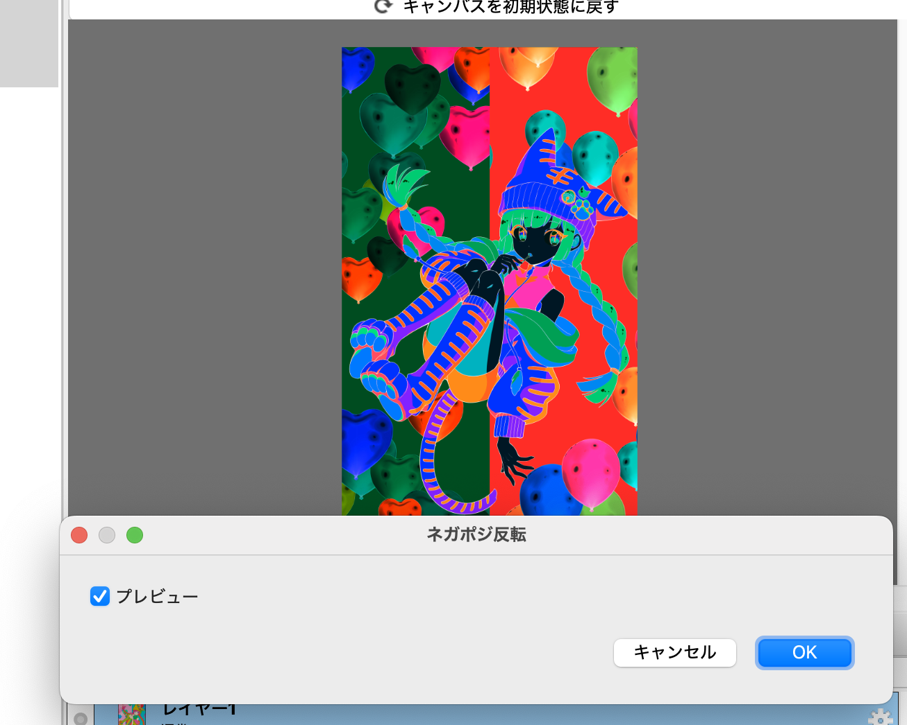
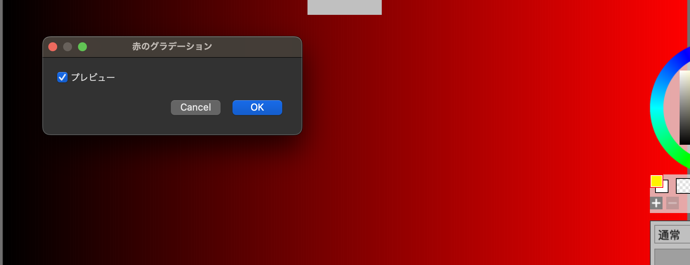

# 02 入力と基本的な演算

[前回](01_HelloMFG.md)は入力の画像を使わないフィルタを書きました。

今回は入力のピクセルに応じた色を塗るフィルタを書いていきましょう。
それにあたり、letによる変数や基本的な演算についても簡単に触れます。

このページでは以下の事を学びます。

- letによる変数定義
- 算術演算
- input_u8による入力の色の取得
- ifelによる条件分岐
- samplerによる境界処理

## letによる変数と演算

MFGでは定数を定義するのにletを使います。

例えば以下のようにletで変数を定義する事が出来ます。

```swift
let a = 123
```

letは変更不可のローカル変数を定義するものです。MFGではテンソル周辺を除き、原則として変数は変更出来ません。

変数を使って、前回やった、すべて赤で塗りつぶすというフィルタを以下のように書く事が出来ます。

```swift
@title "赤で塗りつぶす2"

def result_u8 |x, y| {
  let col = 0xffff0000
  let a = col >> 24
  let r = ((col>>16)&0xff)
  let g = ((col>>8)&0xff)
  let b = (col&0xff)
  u8[b, g, r, a]
}
```

`>>`は右シフト、 `&` はビット積（ビット単位のAND）です。0xffff0000などの0xで始まる数字は16進数として解釈されます。
なお、整数の型はいつもi32で固定です。

colという変数に`0xffff0000`を入れて、その上位8bitをaに、その次をrに、その次をgに…と入れていって、
最後に`u8[b, g, r, a]`を色としています。これは`u8[0, 0, 0xff, 0xff]`と同じ事になります。

MFGでは文の終わりは改行でセミコロンなどはありません。

なお、細かい話ですが、このようにテンソル定義のブロックの中に複数の文がある時は、最後の式の結果がこのテンソルのピクセル値となります。 
他の言語でいう所のreturnなどはありません。

なお、r, g, bは8ビットの値なので、0xffから引く事で反転させる事が出来ます。
以下のようにすると、RGBでいう所の0x00FFFF、つまり水色っぽい色で塗りつぶす事になります。

```swift
@title "赤を反転した色で塗りつぶす"

def result_u8 |x, y| {
  let col = 0xffff0000
  let a = col >> 24
  let r = 0xff - ((col>>16)&0xff)
  let g = 0xff - ((col>>8)&0xff)
  let b = 0xff - (col&0xff)
  u8[b, g, r, a]
}
```

## ネガポジ反転フィルタを作ろう

ここまでは入力のレイヤーの画像を使わないフィルタを作りました。ここでは入力のピクセルの値を必要とするフィルターとして、ネガポジ反転のフィルタを作ってみましょう。

スクリプトとしては以下のようになります。

```swift
@title "ネガポジ反転"

def result_u8 |x, y| {
  let [b, g, r, a] = input_u8(x, y)
  u8[255-b, 255-g, 255-r, a]
}
```

実行すると以下のようになります。



以下、スクリプトを簡単に見ていきましょう。

### 入力のレイヤーを表すのはinput_u8テンソル

input_u8というのは最初から定義されているテンソルの一つで、入力のレイヤーを表します。

関数呼び出しのようなシンタックスで、BGRA値が符号なし8bit整数のベクトルとして取得出来ます。

例えば、以下のようにすれば、(32, 45)の点の色が取れます。

```swift
input_u8(32, 45)
```

### タプルとdestructuring

色を受け取る所は、以下のように書かれています。

```cpp
let [b, g, r, a] = input_u8(x, y)
```

この左辺の大かっこ `[` と `]` はタプルを定義するシンタックスですが、これがletの左辺で使われるとdestructuringとして要素に分解されるというシンタックスになります。
少し難しい機能なので、まずは色を受け取る時はこう書く、と覚えてしまっても良いでしょう。

input_u8は入力を、B, G, R, Aの順番で、それぞれが8ビットのタプルとして扱います。それを上記のようなやり方で、b, g, r, aの4つの変数に一気に代入する事が出来ます。

なお、使わない要素は `_` を置きます。例えばaはいつも255にしたい場合は以下のようにします。

```swift
def result |x, y| {
  let [b, g, r, _] = input(x, y)
  u8[255-b, 255-g, 255-r, 255]
}
```

以上でネガポジ反転のフィルタが出来ました。

## 左上に5pxずつ移動するフィルタを書く

入力が使えるようになったので、次は入力のすべての点を左に5px、上に5px移動するフィルタを書きましょう。移動した時に新しく右下から出てくる所に関しては、透明（値としては0）を入れておく事にします。

まずは、一番原始的な方法で手書きする方法を書いてみます。以下のようになります。

```swift
@title "左上に5px移動、手書きバージョン"

def result |x, y| {
  let [newx, newy] = [x+5, y+5]
  ifel(newx < input_u8.extent(0) && newy < input_u8.extent(1),
       input_u8(newx, newy),
       u8[0, 0, 0, 0])
}
```

要素としては `ifel` と `input_u8.extent(0)` などが新しいものですね。最初のletも右辺がタプルと新しいので簡単に見ていきます。

### タプルのdestructuring

最初のletは以下のようになっています。

```swift
  let [newx, newy] = [x+5, y+5]
```

この左辺はタプルのdestructuringになります。右辺はこれがタプルの定義となります。

これは以下と同じコードになります。

```swift
let newx = x+5
let newy = y+5
```

慣れないうちはこちらの方が読みやすいかもしれませんが、慣れてくるとx, yのペアなど概念的に対応しているものはタプルのdestructuringを使う方が読みやすくなると思います。

### 画像の幅はinput_u8.extent(dim)で取得

input_u8の画像の幅は、 `input_u8.extent(dim)` で取れます。dimは0だと横幅、1だと高さです。

だから例えば、全体を赤のグラデーションにしたい場合は以下のように書けます。

```swift
@title "赤のグラデーション"

def result_u8 |x, y| {
  u8[0, 0, 255*x/(input_u8.extent(0)), 255]
}
```



厳密にはこれだと一番端が255では無く254になってしまいますが、勉強目的としては十分でしょう。

### やってみよう: 高さ方向と幅方向の両方のグラデーション

赤のグラデーションを少し変更して、Y方向にもグラデーションしてみましょう。X方向は先程と同様赤で、Y方向はとりあえず緑コンポーネントを同様にグラデーションしてみましょう。

### ifel関数

たいていのプログラム言語にはifとelseがあります。これらは文である言語も多いですが、MFGではこれは関数になっています。RやLispなどと似ていますね。細かい話をすればショートカットのある特殊な関数です。

シンタックスは以下となります。

```swift
ifel( COND, TRUE_VALUE, FALSE_VALUE )
```

CONDがtrueの時はTRUE_VALUEが、falseの時はFALSE_VALUEが返ります。

最初のスクリプトの例では、以下のように使われています。

```swift
  ifel(newx < input.extent(0) && newy < input.extent(1),
       input_u8(newx, newy),
       u8[0, 0, 0, 0])
```

最初の条件で、newxとnewyが入力画像に収まっていればその点を、そうでなければ`u8[0, 0, 0, 0]`をresultのピクセルに使う、という意味になります。

### サンプラーのClampToBorderValueで境界を処理

画像処理では、この端をどう処理するか、というのは良くある問題なので、MFGではサンプラーと呼ばれる特別な仕組みが用意されています。画面の範囲外の扱いはaddress modeと呼ばれるもので指定します。画面の範囲外は同じ色だとみなすClampToBorderValue、という機能があります。

それを用いると左上に移動するフィルタは以下のように直せます。

```swift
@title "左上に5px移動、ClampToBorderValueバージョン"

let extended = sampler<input_u8>(address=.ClampToBorderValue, border_value=u8[0, 0, 0, 0] )

def result |x, y| {
  extended(x+5, y+5)
}
```

newx, newyを用いるまでも無くなってしまったのでそのままx+5, y+5と書いています。随分と簡単になってしまいましたね。普通はこう書きますが、ハンズオンとしてはこれでは簡単すぎますね。

samplerの文は以下のようになっています。

```swift
let extended = sampler<input_u8>(address=.ClampToBorderValue, border_value=u8[0, 0, 0, 0] )
```

samplerは内部的には関数では無く、テンソルを角括弧の引数にとって、新しいテンソルのように見えるものを返します。この場合は `<input_u8>` という所ですね。

アドレスモードの指定はaddressという引数で行います。これにはenum値を指定します。enum値はドットで始まるシンボルで、この場合は.ClampToBorderValueを指定しています。これは範囲外の時にはborder_valueの値を使う、という意味です。

そしてborder_valueという引数に`u8[0, 0, 0, 0]`を指定しています。これで、範囲の外はすべて`u8[0, 0, 0, 0]`を返す、という意味になります。

いつも赤にしたければ以下のようになります。

```swift
let extended = sampler<input_u8>(address=.ClampToBorderValue, border_value=u8[0, 0, 0xff, 0xff] )
```

なお、良く使うアドレスモードとしてはClampToBorderValueの他に、端の値がずっとそのまま続くとみなす、ClampToEdgeというのがあります。

```swift
let extended = sampler<input_u8>(address=.ClampToEdge)
```

ぼかす処理などはこちらが良いでしょう。
