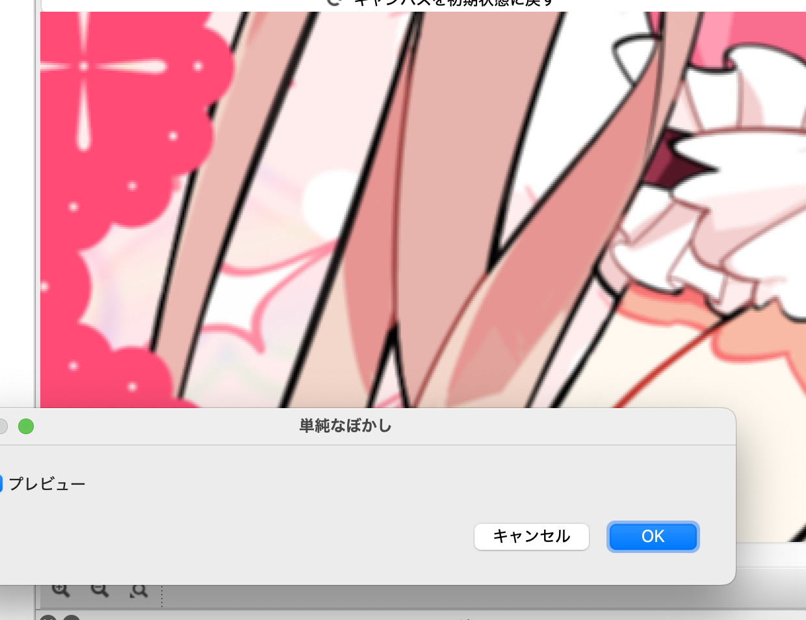

# 03 ベクトル演算とrsum

今回は複数の処理をまとめて行う、ベクトル演算を見ていきます。
また、他の言語のループに相当する、rsumという命令についても見ていきます。

## ぼかし処理

画像処理では、ぼかしの効率的な計算手法として、縦に上下に足したあとに横に左右に足す、という方法がある事が知られています。
今回は、このぼかし処理を題材に、ベクトル演算やrsumについて学びます。

ここでは、上下1px、左右1pxの合計3x3のぼかし処理を見ていきます。

## 水平3pxのぼかし

最終的には上下と左右のそれぞれの平均を求めるのが最終的にやりたい事ですが、
これは9回同じ処理を書かなくてはいけないので、説明が少し大変です。

そこでまずは左右の隣接するピクセルとの平均を取るぼかし処理を見て、これを簡潔に書く方法を見ていきます。

### ClampToEdgeによる端の処理

最初に、左右のピクセルを足す時に、一番左端と一番右端の時にどうするか、という事を考える必要があります。

平均でぼかす場合、一番端の色が外側にも繰り返されている、と考えるのが良いでしょう。
これは前回少し触れた、サンプラーを使って実現出来ます。


ここで、最初の以下の部分は、前回やったサンプラーというもので、

```swift
let inputEx = sampler<input_u8>(address=.ClampToEdge)
```

範囲を超えた所のピクセルは、端の色として扱う、というものになります（`.ClampToEdge`）。

### 単純なコピーペーストによる重複処理とオーバーフロー

前回と同じような処理をすると、以下のようになりそうですが、これは8ビットを超えてしまうのでうまくいきません。

```swift
@title "水平ぼかし（オーバーフロー）"

let inputEx = sampler<input_u8>(address=.ClampToEdge)

def result_u8 |x, y| {
  let [bm1, gm1, rm1, am1] = inputEx(x-1, y)
  let [b0, g0, r0, a0] = inputEx(x, y)
  let [b1, g1, r1, a1] = inputEx(x+1, y)

  # bm1+b0+b1などが8bitを超えてしまうので上手く行かない
  u8[(bm1+b0+b1)/3, (gm1+g0+g1)/3, (rm1+r0+r1)/3, (am1+a0+a1)/3]
}
```

結論としてはi32で以下のように囲むのが正解となります。

```swift
  let [bm1, gm1, rm1, am1] = i32(inputEx(x-1, y))
  let [b0, g0, r0, a0] = i32(inputEx(x, y))
  let [b1, g1, r1, a1] = i32(inputEx(x+1, y))

  # bm1などはi32になるので、以下で動く
  u8[(bm1+b0+b1)/3, (gm1+g0+g1)/3, (rm1+r0+r1)/3, (am1+a0+a1)/3]
```

画像処理に詳しい人だと、アルファはこれでいいのか？とか、ガンマ補正はいいのか？とか気になるかもしれませんが、今回は特に考えずに単に平均する事にします。

以下、オーバーフローについての解説を簡単にしてきますが、入門としては少し細かい話となるので、最初は飛ばしてもらっても構いません。

### オーバーフローと型の解説（上級者向け）

以下のように作られた変数は、

```swift
  let [bm1, gm1, rm1, am1] = inputEx(x-1, y)
```

u8型、つまり符号無し8bit整数となります。
これを以下のように3つ足すと、

```swift
bm1+b0+b1
```

オーバーフローの可能性があります。

そこで計算の前にi32にキャストして計算する必要があります。キャストは`i32()`で行えます。具体的には以下のように書きます。

```swift
  let [bm1, gm1, rm1, am1] = i32(inputEx(x-1, y))
  let [b0, g0, r0, a0] = i32(inputEx(x, y))
  let [b1, g1, r1, a1] = i32(inputEx(x+1, y))

  # bm1などはi32になるので、以下で動く
  u8[(bm1+b0+b1)/3, (gm1+g0+g1)/3, (rm1+r0+r1)/3, (am1+a0+a1)/3]
```

このように右辺をキャストしておくと、変数自体がi32になります。またキャストはタプルに対してまとめて行えます。

なお、GPUのプログラムとしては、符号なし8ビットの変数としてコンパイルされますが、多くのハードウェアではこのコードは実際にはオーバーフローせずに動きます。
GPUプログラムの32ビット以外の変数の扱いはかなり曖昧で、正しくないコードを書いた時にどう動くかはある程度ハードウェアや環境任せとなってしまいます。
プログラムとしては正しくi32として計算するように書く事を推奨しています。

なお、MFGでは型としては、i, u, fに、bit数を表す数値をつけます。
iが符号あり整数、uが符号無し整数、fが浮動小数点数です。

GPUは基本的にはレジスタが32bitなので、整数はi32、浮動小数点はf32を使うのが基本になります。
ただしBGRAを8bitで持つ形式だけは良く使われるので、この時だけはu8となります。

なお、MFGでは整数定数はいつもi32になります。C言語などのように自動で型が変わったりはしません。

### タプルとswizzle演算子

さて、`b, g, r, a`について、いちいち別々に変数に置くのはいかにも面倒です。
そこでタプル自体を変数にいれる、という方が見通し良く書けます。

例えば以下を、

```swift
  let [bm1, gm1, rm1, am1] = i32(inputEx(x-1, y))
```

以下のように一つの変数に入れられます。

```swift
  let colm1 = i32(inputEx(x-1, y))
```

これは要素が4つのタプルとなります。
それぞれの要素は以下のようにdestructuringするか、

```swift
  let [bm1, gm1, rm1, am1] = colm1
```

またはswizzle演算子を使ってアクセス出来ます。

```swift
  let bm1 = colm1.x
  let gm1 = colm1.y
  let rm1 = colm1.z
  let am1 = colm1.w
```

swizzle演算子は複数の要素を並べたベクトルにアクセスする事も出来ます。

```swift
  let [bm1, am1] = colm1.xw
```

これを使うと、以下のように書けます。

```swift
def result_u8 |x, y| {
  let colm1 = i32(inputEx(x-1, y))
  let col0 = i32(inputEx(x, y))
  let col1 = i32(inputEx(x+1, y))

  u8[(colm1.x+col0.x+col1.x)/3, (colm1.y+col0.y+col1.y)/3, (colm1.z+col0.z+col1.z)/3, (colm1.w+col0.w+col1.w)/3]
}
```

少し楽になりました。

### ベクトル演算

x, y, z, wのそれぞれの要素について同じ計算を行う事が良くあり、それはベクトル演算としてまとめて行う事が出来ます。

例えば、以下のように、２つの要素をぞれそれ足して新しいタプルを作る場合、

```swift
  let res = [colm1.x+col0.x, colm1.y+col0.y, colm1.z+col0.z, colm1.w+col0.w]
```

以下のようにまとめて行う事が出来ます。

```swift
  let res = colm1+col0
```

これは`+`の他にも加減乗除やベクトル演算対応の関数やifelなどで行う事が出来ます。

これを用いると、先程のプログラムは、以下のようにまとめて書けます。

```swift
@title "水平ぼかし"

let inputEx = sampler<input_u8>(address=.ClampToEdge)

def result_u8 |x, y| {
  let colm1 = i32(inputEx(x-1, y))
  let col0 = i32(inputEx(x, y))
  let col1 = i32(inputEx(x+1, y))

  u8((colm1+col0+col1)/3)
}
```

最後にu8にキャストする必要がありますが、まとめて平均を計算する事が出来ました。

### rsumを用いて処理を一つに

他の言語ではループを使う事でこういった処理を行う事が出来ます。
MFGでも似たような処理として、rsumというものがあります。

これを使うと以下のように書けます。

```swift
def result_u8 |x, y| {
  let col = rsum(0..<3) |i| {    
    i32(inputEx(x-2+i, y))
  }

  u8(col/3)
}
```

rsumはreduce sumの略で、指定された範囲ブロックを実行し、その合計を返します。
ブロックという新しい用語が出てきたので、少し詳しく見ていきます。

### rsumとブロック

rsumは引数に範囲を取ります。範囲は1次元、2次元の二通りがあります。

```swift
# 一次元
rsum (0..<3) |i| { i+2 }

# ２次元
rsum(0..<3, 0..<5) |i, j| { i+j+5 }
```

範囲は `0..<3` などと書くと順番に0, 1, 2の範囲とみなされます。3は含まれない事に注意してください。

指定された範囲を、ブロックを実行します。
ブロックは以下の形です。

```swift
|i| { 
  # ここに式を書く
}
```

iはブロックの仮引数で、rsumの場合は順番に数字が入ります。iの名前はなんでも構いません。

２次元の場合はこれが２つになります。

```swift
|i, j| {
  # ここに式を書く
}
```

rsumは式を評価した結果を足し合わせた結果を返します。

rsumは普通の言語のループに近いものですが、いくつか制約があります。

- ループの範囲を途中で広げる事は出来ない（最初に決めた回数だけ実行する）
- ループの途中で終了する方法は無い（必ずすべて実行される）

この辺は実際のGPUの仕組みに沿った仕様となっています。

ちなみに、範囲は0からである必要はありません。
以下のように-1から始める事も出来ます。

```swift
  let col = rsum(-1..<2) |i| {    
    i32(inputEx(x+i, y))
  }
```

-1から1までのループなのに終わりの指定が2になるのはちょっと注意が必要ですね。

### 一番単純なぼかし処理

以上を使って、垂直方向にも和を求める計算を行ってみます。

```swift
@title "単純なぼかし"

let inputEx = sampler<input_u8>(address=.ClampToEdge)

def result_u8 |x, y| {
  let sum = rsum(0..<3, 0..<3) |i, j| {
    i32(inputEx(x-2+i, y-2+i))
  }
  u8(sum/9)
}
```

前後1pxなので拡大しないと効果がわかりにくいですが、以下のようになっています。

**ぼかし処理前**  


**ぼかし処理後**  


