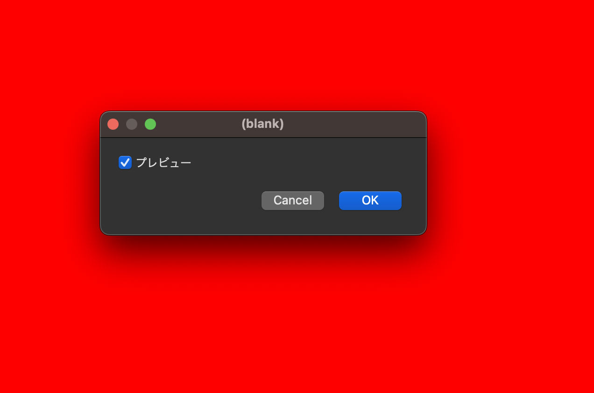
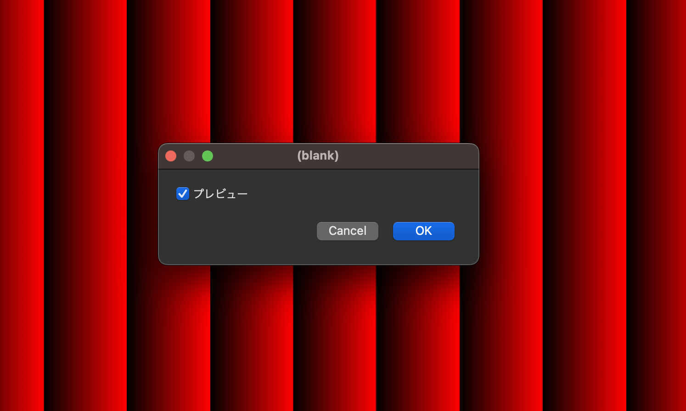
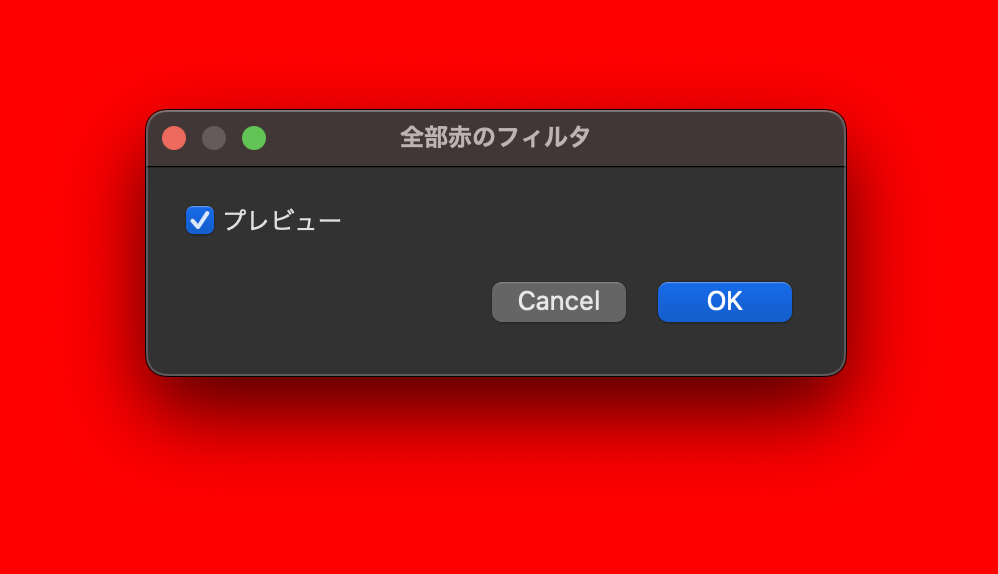
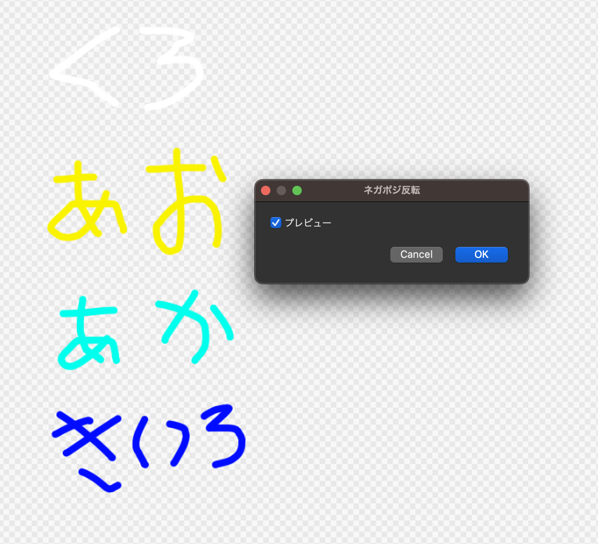
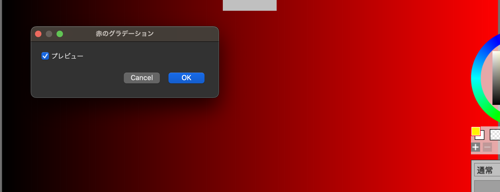

# ハローMFG

一番最初に触ってみる事を意図したハンズオン。

MFGはフィルタを書く為の言語で、GPUで動く事を前提としています。以下では簡単にどういうものか見ていきましょう。

## 全部赤のフィルタ

一番最初に書くのは、全部赤に塗りつぶすだけの一番簡単なフィルタです。フィルタはレイヤーに適用する為、まずは適当なキャンバスにレイヤーを一つ作りましょう。

そしてMFGのエディタを表示します。MFGのエディタの出し方は環境により違いますが、FireAlpaca SE 3.0 ではメニューの Filter の中に MFG Editor という項目があるのでこれを選びます。

そこに以下を書きます。

```cpp
def result_u8 |x, y| {
  u8[0, 0, 0xff, 0xff]
}
```

実行してみましょう。（なおQtSample2の場合、一度キャンバスをアクティブにしないと実行出来ないかもしれないので、Runを押して反応なければキャンバスエリアをクリックしてみてからRunしてみてください。たぶんバグ）



これで全部赤に塗りつぶすフィルタが出来ました。

以下、上記のコードの詳細を見ていく事から始めます。

### result_u8テンソルで結果の画像を生成

MFGは、基本的にはテンソルの生成を並べる事でフィルタとします。テンソルはさしあたってには二次元の画像と思っておいて良いでしょう。

そしてMFGのフィルタはいつも、最終的には「result_u8」という名前のテンソルを生成する必要があり、これがフィルタ結果の画像となります。

テンソルの定義は以下のように行います。

```cpp
def result_u8 |x, y| {
   何かの式
}
```

### テンソルは、聞かれた座標の点の色を返す事で生成する

MFGでは、「このx, yの色はなんですか？」と聞いてきた事に対して、その色を返す事でテンソルを生成します。

MFGはGPUで動く事を前提とした言語なので、CPUのプログラム言語に慣れた人にはわかりにくい所がここです。自分から点を打つのでは無く、聞かれた座標の色を返さないといけません。

どの点についてかは、この場合はx, yに座標が入っていますが、今回はすべて赤に塗りつぶすという事で座標に関係なく赤を返すので使っていません。

赤、というのは以下のようになっています。

```cpp
u8[0, 0, 0xff, 0xff]
```

`u8[]`は中のものをu8としてみなしたベクトルとする、という意味です。現時点ではresult_u8の最後はいつもこれにする、と覚えてしまってもいいでしょう。

順番はBGRAの順番です。この場合は赤成文とα成文が0xffで他は0という意味で、全体で赤を表します。

なお、コメントアウトはシャープで、シャープより後は行末まで無視されます。だから以下のようにすると、色は緑になるでしょう。

```cpp
def result_u8 |x, y| {
  # u8[0, 0, 0xff, 0xff]
  u8[0, 0xff, 0, 0xff]
}
```

さて、ここまではxとyを使っていませんでした。

せっかくなのでxとyを使ってみましょう。とりあえずxが100ピクセル単位でグラデーションのように赤の度合いを強めるようにしてみましょう。

```cpp
def result_u8 |x, y| {
  u8[0, 0, (0xff*x)/100, 0xff]
}
```

すると以下のようになります。



### やってみよう: y座標も使う

返す色を以下のようにyも使ってみるとどうなるでしょうか？

```cpp
u8[0, (0xff*y)/100, (0xff*x)/100, 0xff]
```

### タイトルもつけよう

現時点ではフィルタを実行した時のダイアログのタイトルが「(blank)」と表示されています。これを「全部赤のフィルタ」というタイトルに変えてみましょう。

フィルタのダイアログを指定するには `@title` というのを使います。

```cpp
@title "全部赤のフィルタ"

def result_u8 |x, y| {
  u8[0, 0, 0xff, 0xff]
}
```

すると以下のようになります。



ダイアログのタイトルが「全部赤のフィルタ」になっている事を確認してください。

なお、このアットマークで始まるものは「attribute」と呼んでいます。

### 全部赤のフィルタ、まとめ

ここまで学んだ事を簡単にまとめておきましょう。

- MFGではテンソルの定義を並べる事でフィルタを作る
- result_u8という特別な名前のテンソルが最終結果を表す
- `u8[]`で色をつくる
- `@title` でダイアログのタイトルを指定できる

## ネガポジ反転フィルタを作ろう

ここまでは入力のレイヤーの画像を使わないフィルタを作りました。ここでは入力のピクセルの値を必要とするフィルターとして、ネガポジ反転のフィルタを作ってみましょう。

スクリプトとしては以下のようになります。

```cpp
@title "ネガポジ反転"

def result_u8 |x, y| {
  let [b, g, r, a] = input_u8(x, y)
  u8[255-b, 255-g, 255-r, a]
}
```

実行すると以下のようになります。



以下、スクリプトを簡単に見ていきましょう。

### 入力のレイヤーを表すのはinput_u8テンソル

input_u8というのは最初から定義されているテンソルの一つで、入力のレイヤーを表します。

関数呼び出しのようなシンタックスで、BGRA値が符号なし8bit整数のベクトルとして取得出来ます。

例えば、以下のようにすれば、(32, 45)の点の色が取れます。

```cpp
input_u8(32, 45)
```

### 定数の定義をするlet

MFGでは定数を定義するのにletを使います。letは変更不可のローカル変数を定義するものです。MFGではテンソル周辺を除き、原則として変数は変更出来ません。

赤を反転した色で塗りつぶすようなフィルタは以下のように書く事が出来ます。

```cpp
@title "赤反転"

def result_u8 |x, y| {
  let col = 0xffff0000
  let a = col >> 24
  let r = 255u - ((col>>16)&0xff)
  let g = 255u - ((col>>8)&0xff)
  let b = 255u - (col&0xff)
  u8[b, g, r, a]
}
```

`>>`は右シフト、 `&` はビット積（ビット単位のAND）で、0xffは符号なし16進数リテラルです。この辺はC言語などの他の言語と同様なので詳細はそちらを参照ください。

MFGでは文の終わりは改行でセミコロンなどはありません。

また、符号ありと符号無しの整数で引き算などは、同じサイズ同士だと出来ません。（注：この辺のルールはまだ曖昧なのでリリースまでにもう少し整理予定）。キャストを明示的にする必用があります。この例で`255u` と最後にuをつける事で、符号なし整数を表せます（0xで始まる場合はいつも符号無し、普通の10進数の場合は符号あり32bit 整数、uをつけると32bit符号無し整数）

このようにテンソル定義のブロックの中に複数の文がある時は、最後の式の結果がこのテンソルのピクセル値となります。 

### タプルとdestructuring

元のスクリプトでは以下のように書かれています。

```cpp
let [b, g, r, a] = input_u8(x, y)
```

この左辺の大かっこ `[` と `]` はタプルを定義するシンタックスですが、これがletの左辺で使われるとdestructuringとして要素に分解されるというシンタックスになります。

input_u8は入力を、R, G, B, Aでそれぞれが8ビットのタプルとして扱います。それを上記のようなやり方で、b, g, r, aの4つの変数に一気に代入する事が出来ます。

なお、使わない要素は `_` を置きます。例えばaはいつも255にしたい場合は以下のようにする。

```cpp
def result |x, y| {
  let [b, g, r, _] = input(x, y)
  u8[255-b, 255-g, 255-r, 255]
}
```

## 左上に5pxずつ移動するフィルタを書く

入力が使えるようになったので、次は入力のすべての点を左に5px、上に5px移動するフィルタを書きましょう。移動した時に新しく右下から出てくる所に関しては、透明(値としては0）を入れておく事にします。

まずは、一番原始的な方法で手書きする方法を書いてみます。以下のようになります。

```cpp
@title "左上に5px移動、手書きバージョン"

def result |x, y| {
  let [newx, newy] = [x+5, y+5]
  ifel(newx < input_u8.extent(0) && newy < input_u8.extent(1),
       input_u8(newx, newy),
       u8[0, 0, 0, 0])
}
```

要素としては `ifel` と `input_u8.extent(0)` などが新しいものですね。最初のletも右辺がタプルと新しいので簡単に見ていきます。

### タプルのdestructuring

最初のletは以下のようになっています。

```cpp
  let [newx, newy] = [x+5, y+5]
```

この左辺はタプルのdestructuringになります。右辺はこれがタプルの定義となります。

タプルに関しては入門では使わないので、単なる便利なシンタックス程度に思ってください。これは以下と同じコードになります。

```cpp
let newx = x+5
let newy = y+5
```

慣れないうちはこちらの方が読みやすいかもしれませんが、慣れてくるとx, yのペアなど概念的に対応しているものはタプルのdestructuringを使う方が読みやすくなると思います。

### 画像の幅はinput_u8.extent(dim)で取得

input_u8の画像の幅は、 `input_u8.extent(dim)` で取れます。dimは0だと横幅、1だと高さです。

だから例えば、全体を赤のグラデーションにしたい場合は以下のように書けます。

```cpp
@title "赤のグラデーション"

def result_u8 |x, y| {
  u8[0, 0, 255*x/(input_u8.extent(0)), 255]
}
```



厳密にはこれだと一番端が255では無く254になってしまいますが、勉強目的としては十分でしょう。

### やってみよう: 高さ方向と幅方向の両方のグラデーション

赤のグラデーションを少し変更して、Y方向にもグラデーションしてみましょう。X方向は先程と同様赤で、Y方向はとりあえず緑コンポーネントを同様にグラデーションしてみましょう。

### ifel関数

たいていのプログラム言語にはifとelseがあります。これらは文である言語も多いですが、MFGではこれは関数になっています。RやLispなどと似ていますね。細かい話をすればショートカットのある特殊な関数です。

シンタックスは以下となります。

```cpp
ifel( COND, TRUE_VALUE, FALSE_VALUE )
```

CONDがtrueの時はTRUE_VALUEが、falseの時はFALSE_VALUEが返ります。

最初のスクリプトの例では、以下のように使われています。

```cpp
  ifel(newx < input.extent(0) && newy < input.extent(1),
       input_u8(newx, newy),
       u8[0, 0, 0, 0])
```

最初の条件で、newxとnewyが入力画像に収まっていればその点を、そうでなければ`u8[0, 0, 0, 0]`をresultのピクセルに使う、という意味になります。

### サンプラーのClampToBorderValueで境界を処理

画像処理では、この端をどう処理するか、というのは良くある問題なので、MFGではサンプラーと呼ばれる特別な仕組みが用意されています。画面の範囲外の扱いはaddress modeと呼ばれるもので指定します。画面の範囲外は同じ色だとみなすClampToBorderValue、という機能があります。

それを用いると左上に移動するフィルタは以下のように直せます。

```cpp
@title "左上に5px移動、ClampToBorderValueバージョン"

let extended = sampler<input_u8>(address=.ClampToBorderValue, border_value=u8[0, 0, 0, 0] )

def result |x, y| {
  extended(x+5, y+5)
}
```

newx, newyを用いるまでも無くなってしまったのでそのままx+5, y+5と書いています。随分と簡単になってしまいましたね。普通はこう書きますが、ハンズオンとしてはこれでは簡単すぎますね。

samplerの文は以下のようになっています。

```cpp
let extended = sampler<input_u8>(address=.ClampToBorderValue, border_value=u8[0, 0, 0, 0] )
```

samplerは内部的には関数では無く、テンソルを角括弧の引数にとって、新しいテンソルのように見えるものを返します。この場合は `<input_u8>` という所ですね。

アドレスモードの指定はaddressという引数で行います。これにはenum値を指定します。enum値はドットで始まるシンボルで、この場合は.ClampToBorderValueを指定しています。これは範囲外の時にはborder_valueの値を使う、という意味です。

そしてborder_valueという引数に`u8[0, 0, 0, 0]`を指定しています。これで、範囲の外はすべて`u8[0, 0, 0, 0]`を返す、という意味になります。

いつも赤にしたければ以下のようになります。

```cpp
let extended = sampler<input_u8>(address=.ClampToBorderValue, border_value=u8[0, 0, 0xff, 0xff] )

```

まぁだいたい0しか使わないですが。

なお、良く使うアドレスモードとしてはClampToBorderValueの他に、端の値がずっとそのまま続くとみなす、ClampToEdgeというのがあります。

```cpp
let extended = sampler<input_u8>(address=.ClampToEdge)
```

ぼかす処理などはこちらが良いでしょう。
