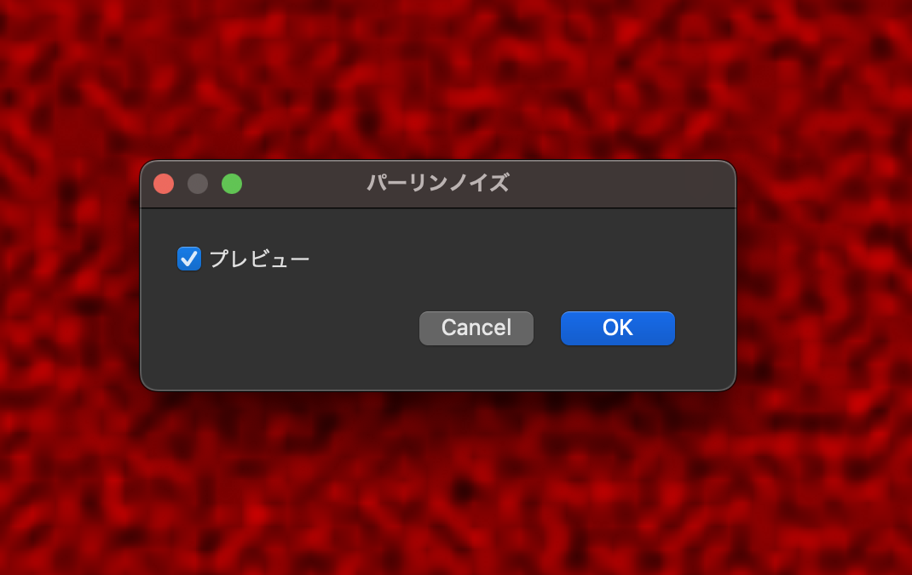
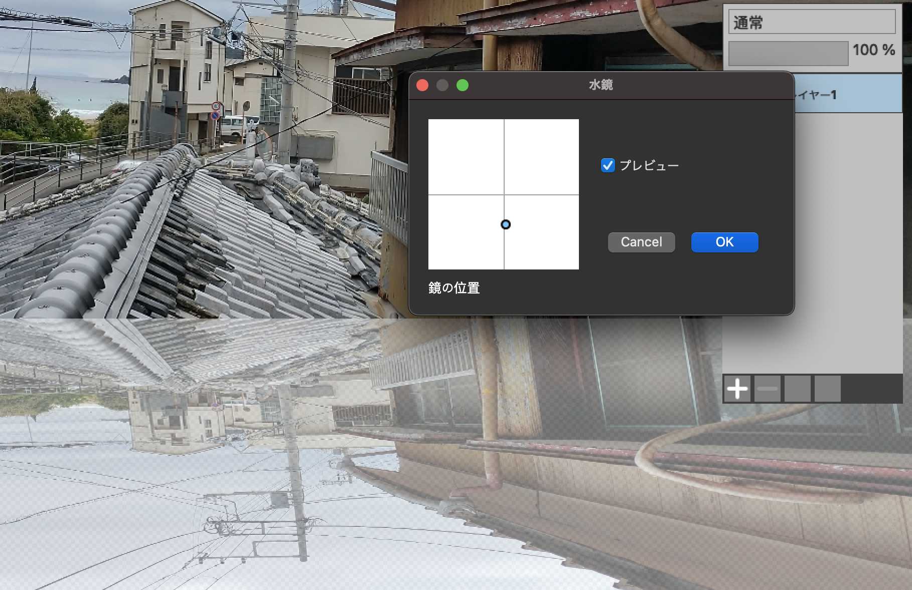
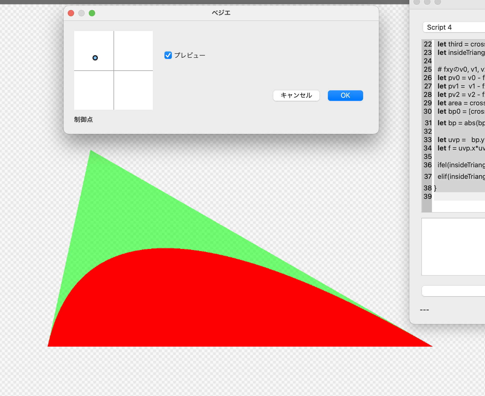
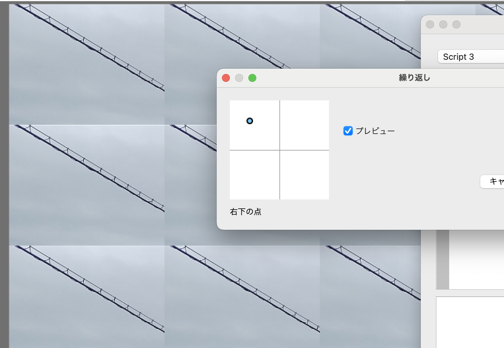

# ウォークスルー

MFGのスクリプトの例を見つつ、入門的な解説を行っていくページです。

以下のページと関連があります。

- [リファレンス](Reference.md)
- [MEP: シンタックスの検討](MEPIndex.md)

## ネガポジ反転

まずは一番簡単なネガポジから

```cpp
@title "ネガポジ反転"

def result_u8 |x, y|{
	let [b, g, r, a] = input_u8(x, y)
  u8[255-b, 255-g, 255-r, a]
}
```

`@title`でこのフィルタのタイトルを指定。メニューにはこの名前が表示される。

defはテンソルの定義。中括弧が各x, yで実行されて、result_u8の値としてセットされる。基本的にはシェーダーのカーネルに対応する。

input_u8とresult_u8は特別な意味を持つ予約語。input_u8は入力のレイヤーのデータを、B8G8R8A8のレイアウトで保持するテンソルで、4次元のu8ベクトルとなる。

result_u8は最終的な結果となるフィルタ結果を表すテンソルで、入力と同じB8G8R8A8のレイアウトとして定義する事で、最終的にこの値がレイヤーに書かれる。

最後の行の値がこのブロックを評価した値とみなされる。最後だけExprになっている。

ブロックの引数は縦棒。

シンタックスはSwift、Rust、F#あたりを参考にしている。

タプルは大かっこでdestructuringも対応。

u8と大かっこで、u8のベクトルを表す。最初の段階ではresult_u8はいつもこれ、と覚えてしまって良い。

内部的にはタプルをキャストするのと同じで、ようするに以下と同じ意味になる。

```cpp
u8([255-b, 255-g, 255-r, a])
```

## モザイク

```cpp
@title "モザイク"
@param_i32 MOSAIC_WIDTH(SLIDER, label="サイズ", min=2, max=256, init=16)

let clamped = sampler<input_u8>(address=.ClampToEdge)

@bounds( (input_u8.extent(0)-1)/MOSAIC_WIDTH+1, (input_u8.extent(1)-1)/MOSAIC_WIDTH+1)
def avg |x, y|{
	rsum(0..<MOSAIC_WIDTH, 0..<MOSAIC_WIDTH) |rx, ry|{
		let [b, g, r, a] = i32(clamped( MOSAIC_WIDTH*x+rx, MOSAIC_WIDTH*y+ry ))
    [*[b, g, r]*a, a]	}
}

def result_u8 |x2, y2| {
let [b2, g2, r2, a2] = avg( x2/MOSAIC_WIDTH, y2/MOSAIC_WIDTH )

  ifel(a2==0, u8[0, 0, 0, 0],
		    u8[*[b2, g2, r2]/a2, a2/(MOSAIC_WIDTH*MOSAIC_WIDTH)] )
}
```

入力パラメータは@paramのあとに型指定を入れる事にする。i32, f32等。flangでは右辺の無い変数定義というのは存在しないので、paramは通常の言語とは違う別の仕組みとして特別扱いしたいのでアットマークをつけている。GUIの事も考えてソースの通常のentityとは別の何かという事にしたい。最初にWidgetの種類を表す識別子、それ以後は名前付き引数の形でウィジェットごとにパラメータを指定する。

キャストはi32, f32などの型の名前の関数。ベクトライズされる。型名はrustに合わせておく。

samplerは引数のテンソルが内部的にはVariableとしては存在しないので、テンソルの指定はシンタックス上で区別する。

引数のenumで種類を指定。引数のenumの種類などはリファレンスを参照。

[MEP 18: デコレータをsamplerと揃える](MEP/18.md)

rsumは通常の関数呼び出しに最後の引数はブロックが外に出せる、という扱いにする。rsumは続きのブロックを評価結果した結果をreduce sumする。

rsumにわたす範囲は「..<」で指定する。これはSwift同様に境界を含まない。

avgにboundsのattributeをつけている。このケースではguess出来るので不要だが、こうやって指定出来る。

boundの指定はdefの前のTopLevelBlockの実行で確定しないとテンソル定義が出来ないが、この時点ではまだパース時に次のTensorの定義はしてないので、次のTensor定義の時に適用する必要がある。この辺の際どい事情をシンタックスで強制すべく、defのattributeのように扱う事にした。

タプルはvectorizationに対応していて、*aなどを各要素に対して行える。

`*`はspread演算子で、タプルの生成と関数呼び出しの引数の時のみ有効なシンタックスシュガー（[MEP 4: タプルのvectorization](MEP/4.md))

## **モーションブラー**

```cpp
@title "移動ぼかし"

@param_f32 strength(SLIDER, label="強度", min=3.0, max=300.0, init=10.0)
@param_f32 angle(SLIDER, label="角度", min=0.0, max=3.2, init=0.0)

let sample = 2

let DeltaU = i32( cos(angle) * 65536 / sample )
let DeltaV = i32( sin(angle) * 65536 / sample )

let mw = i32( strength * sample )

let ar = 0.33 * mw

@bounds(mw+1)
def weights |m|{ 100 * exp( -m*m / (2*ar*ar) ) }

@bounds(input.extent(0), input.extent(1))
def mid_all |x, y| {
  rsum(-mw..<mw+1) |rx| {

	  let px = x + ((DeltaU * rx) >> 16)
	  let py = y + ((DeltaV * rx) >> 16)
	  
    let inside = input_u8.is_inside(px, py)
    let gauss = ifel(inside, weights( abs(rx) ), 0.0)
	
    let [b, g, r, a] = f32(input_u8( px, py ))
	  let ga = gauss * a
	
		[
			*[b, g, r]*ga,
	    ga,
	    gauss
	   ]
	}
}

def result_u8 |x, y| {
  let [mid_b, mid_g, mid_r, mid_a, count] = mid_all(x, y)

  ifel( mid_a == 0,
    u8[0, 0, 0, 0],
    u8[*[mid_b, mid_g, mid_r]/mid_a,  (mid_a / count)]
  )
}
```

DirectComputeにはu64が無いのでMFGもu64は無し。
という事で中間の値にはf32を使っている。

## **レンズぼかし**

レンズぼかしも書いてみるか。愚直に全ピクセルで計算する。

```fsharp
@title "レンズぼかし"
@param_i32 radius(SLIDER, label="半径", min=1, max=200, init=5)

let extended = sampler<input_u8>(address=.ClampToBorderValue, border_value=u8[0, 0, 0, 0] )

# y座標をindexにした、円の外周のx座標。
# ただdy1は0〜2rまでの値をとり、中心を原点とするなら y = dy1-r （これでyは-r〜rとなる）

@bounds(2*radius+1)
def edge |dy1|{
 i32(sqrt( f32(radius^2 - (dy1 - radius)^2) ))
}

let area = edge.sum |i, val| { 2*val+1 }

@bounds(input.extent(0), input.extent(1))
def expbuf |x, y| {
  let [b, g, r, a] = f32(extended(x, y))

  let rcomp = r*r*a
  let gcomp = g*g*a
  let bcomp = b*b*a

  [bcomp, gcomp, rcomp, a]
}

let extendedExp = sampler<expbuf>(address=.ClampToBorderValue, border_value=[0.0, 0.0, 0.0, 0.0] )

@bounds(input.extent(0), input.extent(1))
def sumList |x, y| {
	rsum(0:2*radius+1, 0:2*radius+1) |r_edgex, r_edgey| {
	  let sx = x+r_edgex-radius
	  let sy = y+r_edgey-radius

		ifel((r_edgex-radius)^2 + (r_edgey-radius)^2 <= radius^2,
		  extendedExp(sx, sy),
			[0.0, 0.0, 0.0, 0.0]
		)
	}
}

def result |x, y|{
  let [b3, g3, r3, a3] = sumList(x, y)/area

  u8[*sqrt([b3, g3, r3]/a3), a3]
}
```

rsumはループ変数のみだが、edge.sumは値も渡ってくるのは変か？でもだいたい使うだろうしなぁ。

edge.sumでカッコを省略出来るのは、引数一つでブロックの時はカッコが省略出来るとしよう。この辺はkotlinと同じ感じで、最後のブロックはカッコの外に出せて、引数が一つの場合はカッコを省略出来る、という事にする。だが今の所複数引数があるブロック引数を持つものは存在しないので、引数一つだけ特別扱い。

最初に一旦sumListなどに入れる必要は無いのだが、読みづらいので一旦変数に入れた。

追記: 境界の扱いがバグってたので修正。ただしもとのスクリプトはedge.sumの例になっているので遺しておく。

```fsharp
@title "レンズぼかし"
@param_i32 radius(SLIDER, label="半径", min=1, max=200, init=5)

let extended = sampler<input_u8>(address=.ClampToBorderValue, border_value=u8[0, 0, 0, 0] )

# y座標をindexにした、円の外周のx座標。
# ただdy1は0〜2rまでの値をとり、中心を原点とするなら y = dy1-r （これでyは-r〜rとなる）

@bounds(2*radius+1)
def edge |dy1|{
 i32(sqrt( f32(radius^2 - (dy1 - radius)^2) ))
}

@bounds(input.extent(0), input.extent(1))
def expbuf |x, y| {
  let [b, g, r, a] = f32(input_u8(x, y))

  let rcomp = r*r*a
  let gcomp = g*g*a
  let bcomp = b*b*a

  [bcomp, gcomp, rcomp, a]
}

@bounds(input.extent(0), input.extent(1))
def sumList |x, y| {
	rsum(0:2*radius+1, 0:2*radius+1) |r_edgex, r_edgey| {
	  let sx = x+r_edgex-radius
	  let sy = y+r_edgey-radius
    let inside = expbuf.is_inside(sx, sy)

		ifel(insinde && (r_edgex-radius)^2 + (r_edgey-radius)^2 <= radius^2,
		  [1.0, *expbuf(sx, sy)],
			[0.0, 0.0, 0.0, 0.0, 0.0]
		)
	}
}

def result |x, y|{
  let [area, b, g, r, a] = sumList(x, y)
  let [b3, g3, r3, a3] = [b, g, r, a]/area

  u8[*sqrt([b3, g3, r3]/a3), a3]
}
```


## 砂あらし

乱数のテストのために、0.5以上だと白、0.5以下だと黒、みたいなフィルタを書いてみよう。

```cpp
@title "砂あらし"

def result_u8 |x, y| {
  ifel( rand() > 0.5, u8[0, 0, 0, 0xff], u8[0xff, 0xff, 0xff, 0xff] )
}
```

### ごま塩ノイズフィルタ

メディアンフィルタなどの動作を確認するためのsalt and pepper noiseをつくるフィルタ。

```cpp
@title "ごま塩ノイズ"

# 0.05とか指定する。randの結果がそれ以下なら白か黒を入れる
@param_f32 SALT_THRESHOLD(SLIDER, label="塩しきい値", min=0.0, max=1.0, init=0.1)
@param_f32 PEPPER_THRESHOLD(SLIDER, label="ゴマしきい値", min=0.0, max=1.0, init=0.1)

def result_u8 |x, y| {
	let r = rand()
  ifel( r < SALT_THRESHOLD,
    u8[0xff, 0xff, 0xff, 0xff], ...)
  elif( (1.0 - r) < PEPPER_THRESHOLD,
    u8[0, 0, 0, 0xff],
    input_u8(x, y))
}
```

…はその次のexpressionに置換される。ifelとelifを並べたい時用のシンタックスシュガー。

elifと…については以下を参照。

[MPE 1: Selectの改善](MEP/1.md)

## Weighted Median Filter

以下に移動。

[notes: メディアンフィルタのスクリプト案を検討](notes/MedianFilter.md)

現在の結論

```cpp
def weight by [[1, 2, 1],
               [2, 3, 2],
               [1, 2, 1]]

# xとyがmedianを求められるように、
# x: 1〜w-1
# y: 1〜h-1
# の範囲で計算する。
@bounds(input_u8.extent(0)-2, input_u8.extent(1)-2)
def median |x, y| {
  @bounds(256, 4)
  def _hist |i, col| { 0 }

  weight.for_each |ix, iy, wval| {
     let [b, g, r, a] = input_u8(ix+x, iy+y)
     mut! _hist(b, 0) += wval
     mut! _hist(g, 1) += wval
     mut! _hist(r, 2) += wval
     mut! _hist(a, 3) += wval
  }

  # cumsumを求めるが、配列としては_histを上書きしていく（サイズ制限がきついので）
  mut! trans<_hist>.accumulate!(dim=0) |i, col, val, accm | { val+accm }

  # hist(255, rgb)は総登場回数（weightはその分重複して登場したと解釈）。その半分で
  def _med by reduce<_hist>.find_first_index(dim=0) |i, col, val| {
     val >= _hist(255,col)/2
  }
  [_med(0), _med(1), _med(2), _med(3)]
}

def result_u8 |x, y| {
  ifel( x == 0 || y == 0 || x == input_u8.extent(0)-1 || y == input_u8.extent(1) -1,
      input_u8(x, y),
      median(x-1, y-1))
}
```

weightはテンソルリテラル。

`mut! trans<_hist>.XXXX` はtransformと呼ばれる概念とし、これは対象とするテンソルの中身を変更するが型(shape)は変えないものとする。

accumulateのaccmは最初はvalが使われるのでinitが無い。

reduceはtransの軸を潰す版。軸を潰すので次元が変わるから新しいテンソルをいつも生成する。find_first_indexは引数のblockが真となる最初のindexとなる。なお、reduceのaccumulateでも同じ事を実装出来る。find_first_indexはシンタックスシュガー。

別途破壊的sortは提供したいが、まずは汎用的に使えるものを組み合わせて実装出来るのを目指す。

最後のmedianはifelseのショートカットに依存しているな（-1のアクセスがありうる）。VMを廃止した今、全環境でショートカットするようになるのでショートカットする、という仕様にする事にした。

## Weighted Median Filter、ソート版

sortがあったらもっと中間バッファが減るんじゃないか、と考えてみる。median以外はヒストグラム版と同じ。

[MEP 8: sort版メディアンフィルタのスクリプト検討](MEP/8.md)

```cpp
def weight by [[1, 2, 1],
               [2, 3, 2], 
               [1, 2, 1]] 

# xとyがmedianを求められるように、
# x: 1からw-1
# y: 1からh-1
# の範囲で計算する。
@bounds(input_u8.extent(0)-2, input_u8.extent(1)-2)
def median |x, y| {

	@bounds(9)
  def wcumsum |i| {
     let [ix, iy] = [i%3, i/3]
     weight(ix, iy)
  }

  mut! trans<wcumsum>.cumsum!(dim=0)

  # 15はweightの合計。ローカルテンソルなのでIMMでないといけない。
  @bounds(15)
  def wmat |i| {
     let i3 = reduce<wcumsum>.find_first_index(dim=0) |_, val| { i < val }

     let [ix, iy] = [i3%weight.extent(0), i3/weight.extent(0)]
     i32(input_u8(ix+x, iy+y))
  }
  
  mut! trans<wmat>.sort!(dim=0)

  u8(wmat(wmat.extent(0)/2))
}

def result_u8 |x, y| {
  ifel( x == 0 || y == 0 || x == input_u8.extent(0)-1 || y == input_u8.extent(1) -1,
      input_u8(x, y),
      median(x-1, y-1))
}
```

## 下のレイヤーの参照

下のレイヤーを `input_u8[-1]` などで参照出来る。

下のレイヤーとRGB値を足すフィルタは以下。（アルファは現在のレイヤーのを使う）

```jsx
@title "レイヤー和"
def result_u8 |x, y| {
  let [b, g, r, a] = input_u8(x, y)
  let [b2, g2, r2, a2] = input_u8[-1](x, y)
  u8[b+b2, g+g2, r+r2, a]
}
```

一つ上のレイヤーは1、一つ下のレイヤーは-1。

## マンデルブロ集合

[マンデルブロ集合 - Wikipedia](https://ja.m.wikipedia.org/wiki/%E3%83%9E%E3%83%B3%E3%83%87%E3%83%AB%E3%83%96%E3%83%AD%E9%9B%86%E5%90%88)

とりあえず幅と高さを-2.0から2.0に規格化して、100回ループで白と黒だけの一番単純なものを書いてみる。

```cpp
@title "白黒マンデルブロ集合"

def result_u8 |x, y| {
  let x0 = f32(x)*4.0/f32(input_u8.extent(0))-2.0
  let y0 = f32(y)*4.0/f32(input_u8.extent(1))-2.0
  let [flag, _, _] = reduce(init=[0, x0, y0], 0..<100) |index, accm| {
    let [f, x1, y1] = accm
    let x2 = x1^2-y1^2+x0
    let y2 = 2*x1*y1+y0
    let r = x2^2+y2^2
    ifel(f == 1,
         [1, 0, 0],
         ...)
    elif( r > 4,
         [1, 0, 0],
         [0, x2, y2])
  }
  ifel(flag == 1,
       u8[0xff, 0xff, 0xff, 0xff],
       u8[0,  0, 0, 0xff])
}
```

reduceで0から100までのループで順番に値を更新するものを書いている。reduceのシンタックスについては以下を参照。

[MEP 11: rsumの一般化](MEP/11.md)

フラグがどこかで1になってたら1を返し、それ以外の場合はflagに0を、それ以外を漸化式の次の項を入れている。

普通はループの何回目で絶対値が2を越えたかを覚えておいてそれに応じて色付けするらしいが、まずは一番簡単な白黒の塗り分けをやってみた。

次に、ズームと移動をなんとなく足してみよう。

```cpp
@title "白黒マンデルブロ集合"
@param_f32 ZOOM(SLIDER, label="ズーム", min=0.001, max=1.0, init=0.1)
@param_pos ORIGIN(POINTER, label="中心") 

let [ox, oy] = ORIGIN
let [cx, cy] = [ox*f32(input_u8.extent(0)), oy*f32(input_u8.extent(1))]

def result_u8 |x, y| {
  let x0 = 0.1/ZOOM * ((f32(x)-ZOOM*cx)*4.0/f32(input_u8.extent(0))-2.9)
  let y0 = 0.1/ZOOM* ((f32(y)-ZOOM*cy)*4.0/f32(input_u8.extent(1))-2.9)
  let [flag, _, _] = reduce(init=[0, x0, y0], 0..<100) |index, accm| {
    let [f, x1, y1] = accm
    let x2 = x1^2-y1^2+x0
    let y2 = 2*x1*y1+y0
    let r = x2^2+y2^2
    ifel(f == 1,
         [1, 0, 0],
         ...)
    elif( r > 4,
         [1, 0, 0],
         [0, x2, y2])
  }
  ifel(flag == 1,
       u8[0xff, 0xff, 0xff, 0xff],
       u8[0,  0, 0, 0xff])
}
```

`@param_pos` で要素２つのfloatのタプルとして選ばれた位置を返す。値の範囲は0.0〜1.0で中心が0.5。

なんか数学的にちゃんと中心を移動出来てい無さそうだが、ウィジェットの動作確認としてはちゃんと動いている。アルバイトの人が来たら直してもらおう…

## パーリンノイズ

[Perlin noise - Wikipedia](https://en.wikipedia.org/wiki/Perlin_noise#cite_note-Perlin:1985:IS:325165.325247-2)

とりあえず赤と黒の間で適当に書いてみよう。

格子としては50x50として作り、floatの0.0〜1.0をここにマップする、つまり0.0〜50.0の間の座標に関して計算するとする。

まず50x50の乱数ベクトルは以下。

```cpp
@bounds(50, 50)
def gridNoise |x, y| {
  [2.0*rand()-1.0, 2.0*rand()-1.0]
}
```

randは0.0〜1.0の間。なにも考えずに-1.0〜1.0にした。シータとみなしてcosとsinにすれば乱数が半分に節約出来るがまぁいいだろう。

次に各座標の近くの4点についてoffsetを計算してdot productを計算して適当にスムーシングすれば良さそう。

端が50ぴったりのケースを考えるのが面倒なのでClampToEdgeしておくか。

```cpp
let gridNoiseEx = sampler<gridNoise>(address=.ClampToEdge)
```

49とminをとるだけでいいんだろうが、手抜きということで。

とりあえず格子座標は以下か。

```cpp
def result_u8 |x, y| {
  let [fx, fy] = [f32(x)/f32(W), f32(y)/f32(H)]

  let [gridX0, gridY0] = [i32(fx*50), i32(fy*50)]
  let [gridX1, gridY1] = [gridX0+1, gridY0+1]
```

で、それぞれのオフセットベクトルは要するに引けばいいんだよな。

```cpp
  # 0.0 < dx0, dy0 < 1.0
  # -1.0 < dx1, dy1 < 0.0
  let [dx0, dy0] = [fx*50-gridX0, fy*50-gridY0]
  let [dx1, dy1] = [dx0-1.0, dy0-1.0]
```

で、オフセットと乱数のベクトルの内積をとってinterpolateする。

多分rsumかreduceでいい感じに書けるが、なにも考えずにコピペでかいてみよう。

```cpp
  let [noise00X, noise00Y] = gridNoiseEx(gridX0, gridY0)
  let dp00 = dx0*noise00X+dy0*noise00Y
  
  let [noise10X, noise10Y] = gridNoiseEx(gridX1, gridY0)
  let dp10 = dx1*noise10X+dy0*noise10Y

  let [noise01X, noise01Y] = gridNoiseEx(gridX0, gridY1)
  let dp01 = dx0*noise01X+dy1*noise01Y

  let [noise11X, noise11Y] = gridNoiseEx(gridX1, gridY1)
  let dp11 = dx1*noise11X+dy1*noise11Y
```

あとはx同士でinterpolateしてそのあとy方向にinterpolateすればいいか。

```cpp
  let dp0 = dp00*(1.0-dx0)+dp10*dx0
  let dp1 = dp01*(1.0-dx0)+dp11*dx0

  # -1から1
  let dp = dp0*(1.0-dy0)+dp1*dy0
```

このdpは多分-1〜1だよな。では0.0〜1.0にノーマライズして、なんか適当な色との差分を作ればいいか。

FG_R, FG_G, FG_Bに補完する対象の色が入っているとして、以下か。

```cpp
  let normalized = dp*0.5+0.5
  let [r, g, b] = i32( normalized*[FG_R, FG_G, FG_B] )
  u8[b, g, r, 255]
```

とりあえず赤にしておこう。

全体のコードは以下になった。（グリッド幅を変えて実験しやすいように変数にした）

```cpp
@title "パーリンノイズ"

let [W, H] = input_u8.extent()

let GRID_W = 50

@bounds(50, 50)
def gridNoise |x, y| {
  [2.0*rand()-1.0, 2.0*rand()-1]
}

let gridNoiseEx = sampler<gridNoise>(address=.ClampToEdge)

let FG_R = 255
let FG_G = 0
let FG_B = 0

def result_u8 |x, y| {
  let [fx, fy] = [f32(x)/f32(W), f32(y)/f32(H)]

  let [gridX0, gridY0] = [i32(fx*GRID_W), i32(fy*GRID_W)]
  let [gridX1, gridY1] = [gridX0+1, gridY0+1]

  # 0.0 < dx0, dy0 < 1.0
  # -1.0 < dx1, dy1 < 0.0
  let [dx0, dy0] = [fx*GRID_W-gridX0, fy*GRID_W-gridY0]
  let [dx1, dy1] = [dx0-1.0, dy0-1.0] 

  let [noise00X, noise00Y] = gridNoiseEx(gridX0, gridY0)
  let dp00 = dx0*noise00X+dy0*noise00Y
  
  let [noise10X, noise10Y] = gridNoiseEx(gridX1, gridY0)
  let dp10 = dx1*noise10X+dy0*noise10Y

  let [noise01X, noise01Y] = gridNoiseEx(gridX0, gridY1)
  let dp01 = dx0*noise01X+dy1*noise01Y

  let [noise11X, noise11Y] = gridNoiseEx(gridX1, gridY1)
  let dp11 = dx1*noise11X+dy1*noise11Y

  let dp0 = dp00*(1.0-dx0)+dp10*dx0
  let dp1 = dp01*(1.0-dx0)+dp11*dx0

  # -1から1
  let dp = dp0*(1.0-dy0)+dp1*dy0

  let normalized = dp*0.5+0.5
  let [r, g, b] = i32( normalized*[FG_R, FG_G, FG_B] )
  u8[b, g, r, 255]
}
```



綺麗なコードという感じじゃないが、アルゴリズムそのまんまをなにも考えずに書き下してちゃんと動くのは良いな。

### 改善版

改善版を教えてもらった。

Perlin Noiseは、元論文によると、t=0・t=1で1回微分・2回微分が0となるinterpolationを使うと良いらしく、
具体的には `6 t^2 - 15 t^4 + 10 t^3` を使うと良いらしい。

```
...
 let dp11 = dx1*noise11X+dy1*noise11Y # ここまで上と一緒

 # interpolator, 6 t^5 - 15 t^4 + 10 t^3
  let d0 = [dx0, dy0]
  let [wx, wy] = d0^3*(d0*(6.0*d0 - 15.0) + 10.0)

  let dp0 = dp00*(1.0-wx)+dp10*wx
  let dp1 = dp01*(1.0-wx)+dp11*wx

  # このあとのdpの計算以降は元のコードと同じ
```

## 水鏡

湖面の上に立ってるような絵を見かけたので、鏡っぽくてけれど薄くなるようなフィルタを描いてみる。

```cpp
@title "水鏡"

@param_pos CENTER(POINTER, label="鏡の位置")

let [_, cy] = CENTER
let finput = sampler<input_u8>(coord=.NormalizedLinear)
# let finput = sampler<input_u8>(coord=.NormalizedNearest)

def result_u8 |x, y| {
  let [fx, fy] = to_ncoord([x, y])

  let diff = fy - cy
  let ratio =  diff/(1-cy)
  
  let srcY = cy -   cy*ratio

  let [b, g, r, _] = finput(fx, srcY)
  
  ifel( fy < cy, input_u8(x, y),  u8[b, g, r, 0x88])
}
```

sampler<input_u8>(coord=.NormalizedLinear)で、inputの座標を0.0〜1.0としたサンプラーを作ることができる（間はバイリニア）。テンソルの定義の中（この場合はresult）でto_ncoordを呼ぶと、そのresult内でのピクセルの座標を0.0〜1.0にノーマライズしてくれる（W-1とH-1で割る）。

その他は特に特筆する事は無いと思うが、サンプルとして一応残しておく。



## ベジエ曲線（Loop/Blinn）

趣味で[Resolution Independent Curve Rendering using Programmable Graphics Hardware - Microsoft Research](https://www.microsoft.com/en-us/research/publication/resolution-independent-curve-rendering-using-programmable-graphics-hardware/)を読んだ所、簡単そうだったので実装してみる。

[Bezier quadratic (Loop/Blinn)](https://www.shadertoy.com/view/flG3Rt) とだいたい同じ。

アイデアとしては、重心座標系にすると、論文のuvの座標上の点でも同じ座標になる、という事を使って、あとは論文通りの計算をする。

とりあえず0.0〜1.0の座標系上で考えて、底辺をy=0.8あたりでxを0.2〜0.8くらいとしておくか。

上記リンクのShaderToyでは重心座標をちゃんと求めているが、比率だけが問題なのでareaで割る必要も無いよなぁ。

とりあえず三角形描く所から始めるか。

```cpp
@param_pos v2_pos(POINTER, label="制御点")

# 底辺、とりあえずハードコードで(0.2, 0.8), (0.8, 0.8)とする。3次元にしておく。
let v0 = [0.2, 0.8, 0.0]
let v1 = [0.8, 0.8, 0.0]
let v2 = [*v2_pos, 0.0]
```

とりあえずこの三点の中に入ってたら半透明緑で塗るか。

外積を順番に求めて同じ向き、で判定

```cpp
def result_u8 |x, y| {
  let fxy = [*to_ncoord([x, y]), 0.0]

  let first = cross((v1-v0), fxy - v0).z
  let second = cross((v2- v1), fxy-v1).z
  let third = cross((v0-v2), fxy-v2).z

  ifel(first*second > 0.0 && second*third > 0.0, u8[0, 0xff, 0, 0x88], u8[0, 0, 0, 0])
}

```

良さそう。

重心座標を求めてもいいのだが、もっと簡単に出来ないものか。

v0, v1, v2の点を(0, 0), (0, 1/2), (1, 1)に射影する変換でx, yを変換すればいいんだが。うーん、結局同じ事か。

```cpp

@title "ベジエ"

@param_pos v2_pos(POINTER, label="制御点")

# 底辺、とりあえずハードコードで(0.2, 0.8), (0.8, 0.8)とする。3次元にしておく。
let v0 = [0.2, 0.8, 0.0]
let v1 = [0.8, 0.8, 0.0]
let v2 = [*v2_pos, 0.0]

# uv座標の３つの点
let uv0 = [0.0, 0.0]
let uv1 = [0.5, 0.0]
let uv2 = [1.0, 1.0]

def result_u8 |x, y| {
  let fxy = [*to_ncoord([x, y]), 0.0]

  # v1を起点として三角形を描く。外積の符号で判断
  let first = cross((v1-v0), fxy - v0).z
  let second = cross((v2- v1), fxy-v1).z
  let third = cross((v0-v2), fxy-v2).z
  let insideTriangle = first*second > 0.0 && second*third > 0.0

  # fxyのv0, v1, v2の重心座標を求める。
  let pv0 = v0 - fxy
  let pv1 =  v1 - fxy
  let pv2 = v2 - fxy
  let area = cross(v1-v0, v2-v0).z
  let bp0 = [cross(pv1, pv2).z, cross(pv2, pv0).z, cross(pv0, pv1).z]
  let bp = abs(bp0)/abs(area)

  let uvp =   bp.y*uv0+bp.z*uv1+bp.x*uv2
  let f = uvp.x*uvp.x-uvp.y

  ifel(insideTriangle && f < 0.0, u8[0, 0, 0xff, 0xff] ,...)
  elif(insideTriangle, u8[0, 0xff, 0, 0x88],  u8[0, 0, 0, 0])
}

```

areaで割らなくてもいいような気もするんだが、ダメだった。なんか良く理解出来てない事がありそうだな。（追記：p+q+rで割らないとダメなのを忘れていた。areaで割るとこれが1.0になるのだろう。p+q+rで割っても正しく描けた）



## 繰り返しフィルタ

左上の矩形を繰り返すフィルタを書いてみよう。左上の座標はparamで指定する感じで。

全体を繰り返してもいいのだが、繰り返させるために拡大するようなケースで汚くなるのが嫌なので、左上の領域を繰り返すことにする。（一長一短だが）

```cpp

@title "繰り返し"

@param_pos pos(POINTER, label="右下の点")

let wh = i32(pos*f32(input_u8.extent()))

def result_u8 |x, y| {
  let xy0 = [x, y] % wh
  input_u8(*xy0)
}

```



割と簡単にできたな。
