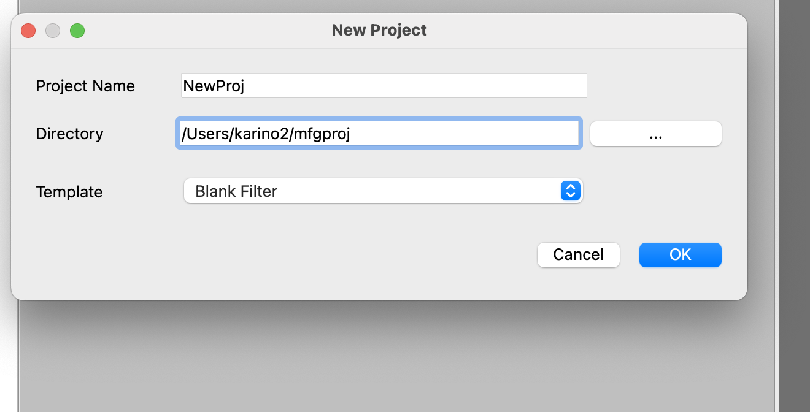
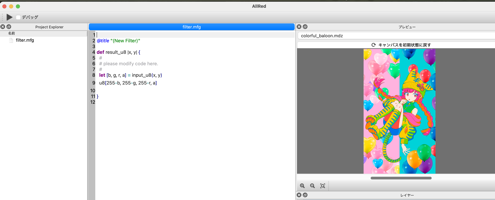
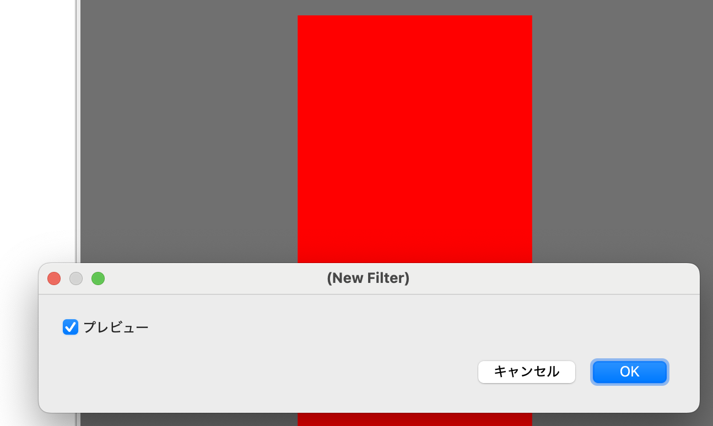
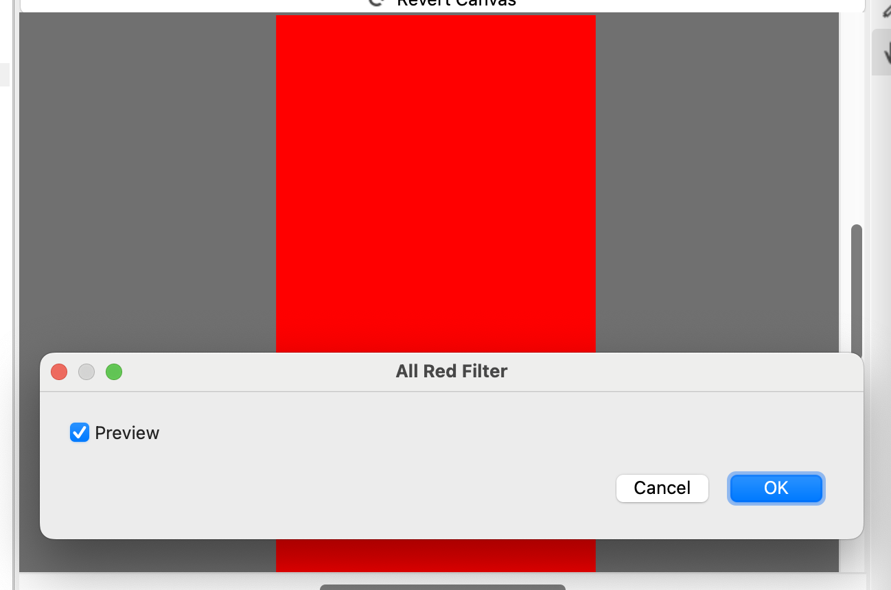

# 01 Hello MFG

Let's write a filter in MFG.
On this page you will learn the following:

- How to create a project
- How to make an all-red filter
- Gradation using x, y
- Title specification

Let's take a look now.

## Creating an AllRed project

In MFGStudio, filters are managed on a per-project basis.
The basic principle is to create one project per filter.

So, to create your first filter, let's create an AllRed project.

Select "New Project" from the File menu.

You should then see a dialog like the one below:



Here we will set it up as follows:

- Project Name: AllRed
- Directory: This allows you to choose the location you want to wake up to and where you like.
- Template: Blank Filter

Then press OK to get the screen like the one below.



### What is created with the AllRed project 

This is your first time creating a project, so before proceeding, let's take a quick look at the components.

First, a directory called AllRed is created in the directory specified in "Directory". Please check this in Explorer or Finder.

In MFGStudio, when a project is open, the title bar is the project name. In this case, please make sure the title bar is "AllRed".

Then, when creating a new MFGStudio project, one file called filter.mfg is created.
This file will then open automatically when it is created.

From now on, you will need to edit this filter.mfg file.

If you select a blank space in the template, the code for the negative positive inverted filter.

The content is like following:

```swift
@title "(New Filter)"

def result_u8 |x, y| {
  #
  # please modify code here.
  #
  let [b, g, r, a] = input_u8(x, y)
  u8[255-b, 255-g, 255-r, a]

}
```

I will explain what this is in the following sections.

## All red filter

Once you've successfully created an AllRed project, let's start writing the filters. This is our first MFG programming.

The easiest program for MFG is a filter that fills all of them with the same color. 
Here, let's write a filter that will fill in all red. 

Here's what the code:

```swift
def result_u8 |x, y| {
  u8[0, 0, 0xff, 0xff]
}
```

Let's run it.



Now we have a filter that fills everything in red.

Below, we look at the details of the above code.

### Generate the resulting image with result_u8 tensor 

MFG is creating filter by arranging tensor generations. For the time being, tensors are viewed as collections of two-dimensional pixels of images. 

And the filter in MFG always needs to eventually generate a tensor named "result_u8" which becomes the image of the filtered result.

The tensor is defined as follows:

```swift
def result_u8 |x, y| {
  Some kind of expression here
}
```

### Tensors are generated by returning the color of the point at the coordinates asked

In MFG, a tensor is generated by answering the question "What is this x, y color?" by returning a color to the question.

MFG is a language that is intended to run on a GPU, so this is something that is difficult for those who are used to programming languages ​​on CPUs.
Instead of hitting the dots yourself, you have to return the color of the coordinates you are asked.

In this case, the coordinates are in x and y, but this time, since the whole thing is filled with red, it returns red regardless of the coordinates, so I haven't used it.

Red is as follows:

```swift
u8[0, 0, 0xff, 0xff]
```

`u8[]` means that the inside is considered as vector of u8.
At this point, it's safe to just remember that this is always the end of results_u8.

The order is BGRA. In this case, red and alpha sentences mean 0xff and the rest are 0, and red is expressed as overall. 

Comment is sharp, and after Sharp it will be ignored until the end of the line. So if you do the following, the color will be green:

```swift
def result_u8 |x, y| {
  # u8[0, 0, 0xff, 0xff]
  u8[0, 0xff, 0, 0xff]
}
```

### Use x and y to make it a gradient 

I haven't used x and y up until now. 

Since we're going to have it, let's try using x and y.
For now, let's try to increase the degree of redness, like a gradient, with x being 100 pixels interval.

```swift
def result_u8 |x, y| {
  u8[0, 0, (0xff*x)/100, 0xff]
}
```

Then it becomes as follows: 


### Let's try: Use y coordinates as well 

What happens if you also use y as the returned color as shown below?

```swift
u8[0, (0xff*y)/100, (0xff*x)/100, 0xff]
```

### Let's give it a title

Currently, the title of the dialog when you run the filter is displayed as "(New Filter)." Let's change this to the title "All Red Filter." 

To specify a filter dialog, use `@title`. 

The following parts

```swift
@title "(New Filter)"
```

Let's change it as follows:


```swift
@title "All Red Filter"
```

Then it becomes as follows: 

 

Make sure the dialog is titled "All Red Filter".

Note that items starting with this at mark are called "attributes."

## Summary of this chapter

Here's a brief summary of what We've learned so far.

- In MFG, create filters by arranging tensor definitions
- A tensor with the special name result_u8 represents the final result
- Create a color with `u8[]`
- You can specify the title of the dialog with `@title`

## Next

[02 Input and Basic Calculations](02_Basic.md)