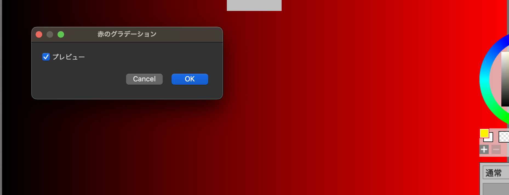

# 02 Input and basic calculations 

Last time, [01 Hello MFG](01_HelloMFG.md), we wrote a filter that does not use the input image.

This time, we'll write a filter that paints the color according to the pixels of the input.
In this regard, we will briefly touch on variables using let and basic operations.

On this page you will learn the following:

- Variable definition using let
- Arithmetic operations
- Get input color with input_u8
- Conditional selection using ifel
- Boundary processing with sampler

## Variables using lets and basic operations 

In MFG, you use let to define constant variables. 

For example, you can define a variable with a let as follows:

```swift
let a = 123
```

Let defines a local variable that cannot be changed. In MFG, variables cannot be changed.
(Only side effect in MFG is those around local tensors, which is very special case.) 

Using variables, you can write the filter I did last time, filling everything in red, as follows:

```swift
@title "All Red Filter 2"

def result_u8 |x, y| {
  let col = 0xffff0000
  let a = col >> 24
  let r = ((col>>16)&0xff)
  let g = ((col>>8)&0xff)
  let b = (col&0xff)
  u8[b, g, r, a]
}
```

`>>` is the right shift and `&` is the bit product (bitwise AND).
Numbers starting with 0x, such as 0xffff0000, are interpreted as hexadecimal numbers.
The integer type is always fixed at i32.

Put `0xffff0000` in the variable col, put the top 8 bits in a, the next to r, and the next to g...
Finally, the color is `u8[b, g, r, a]`. This is the same as `u8[0, 0, 0xff, 0xff]` in this case.

In MFG, the end of a statement is line breaks and there are no semicolons. 

In detail, if there are multiple statements in a block in a tensor definition like this, the result of the last expression is the pixel value of this tensor. 
There is no "return" operation.

Note that r, g, and b are 8 bit values, so you can invert them by subtracting them from 0xff. 
If you do the following, you will be filling it with 0x00FFFF in RGB, which means light blue.

```swift
@title "Fill with red inverted color"

def result_u8 |x, y| {
  let col = 0xffff0000
  let a = col >> 24
  let r = 0xff - ((col>>16)&0xff)
  let g = 0xff - ((col>>8)&0xff)
  let b = 0xff - (col&0xff)
  u8[b, g, r, a]
}
```

## Create a negative-positive inversion filter

Up until now, I have created a filter that does not use data from the input layer.
Here, let's create a negative-positive inversion filter as a filter that requires the input pixel value.

The script looks like this:

```swift
@title "Negative Positive Inversion"

def result_u8 |x, y| {
  let [b, g, r, a] = input_u8(x, y)
  u8[255-b, 255-g, 255-r, a]
}
```

When you run it, it will look like this:


Let's take a quick look at the script.

### The input layer is represented by the input_u8 tensor

input_u8 is one of the predefined tensors which represents the layer of input.

BGRA values ​​can be obtained as vectors of unsigned 8-bit integers by function call like syntax.

For example, if you do the following, you can get the color of the pixel (32, 45).

```swift
input_u8(32, 45)
```

### Tuples and destructuring

The following is the place to receive the colour:

```cpp
let [b, g, r, a] = input_u8(x, y)
```

The brackets `[` and `]` on the left side are syntaxes that define tuples, but when used on the left side of a let, they are decomposed into elements as destructuring.
This is a slightly difficult feature, so it's best to remember to write it like this when receiving colors first.

input_u8 treats the inputs as 8-bit tuples in the order B, G, R, A. This can be assigned to the four variables b, g, r, and a in one go. 

Note that you can place `_` for any elements that are not used. For example, if you want `a` to be always 255, do the following:

```swift
def result_u8 |x, y| {
  let [b, g, r, _] = input_u8(x, y)
  u8[255-b, 255-g, 255-r, 255]
}
```

## Write a filter that moves 5px to the top left

Now that you can use the input, now we'll write a filter that moves all the points on the input to 5px and upwards.
For the new ones that appear from the outside of bottom right, we decide to use transparent (value 0). 

First, I'll write about the most primitive method of handwriting. It looks like this:

```swift
@title "Move 5px to top left, handwritten version"

def result |x, y| {
  let [newx, newy] = [x+5, y+5]
  ifel(newx < input_u8.extent(0) && newy < input_u8.extent(1),
       input_u8(newx, newy),
       u8[0, 0, 0, 0])
}
```

New language features are `ifel` and `input_u8.extent(0)`.
Also the right hand side of first `let` is tuple, which is also new.

### Tuple destructuring

The first let is as follows:

```swift
  let [newx, newy] = [x+5, y+5]
```

This left side is the destructuring of the tuple as previous. On the right side, this is the definition of a tuple.

This will be the same code as below:

```swift
let newx = x+5
let newy = y+5
```

This may be easier to read until you get used to it, but once you get used to it, I think it will be easier to read using the tuple destructuring for conceptual correspondence such as x and y pairs.

### Image width is obtained with input_u8.extent(dim)

The width or height of the image of input_u8 can be obtained by `input_u8.extent(dim)`.
If dim is 0, it is the width, and if 1, it is the height.

So, for example, if you want to make the whole thing red gradation, you can write it as follows:

```swift
@title "Red gradation"

def result_u8 |x, y| {
  u8[0, 0, 255*x/(input_u8.extent(0)), 255]
}
```



Strictly speaking, this will result in a 254 at the very end, not 255, but it is sufficient for study purposes.

### Let's try: Gradations in both height and width directions 

Change the red gradation a little and try gradation in the Y direction as well. In the X direction, the same as before, let's try gradation of the green component in the Y direction.

### ifel function 

Most programming languages ​​include if and else. In many languages, if and else ​​are statements, but in MFG this is a function.
It's similar to R and Lisp. More precisely, it's a special function with shortcuts. 

The syntax is as follows:

```swift
ifel( COND, TRUE_VALUE, FALSE_VALUE )
```

If COND is true, TRUE_VALUE is returned, and if false, FALSE_VALUE is returned.

The first example script is used as follows:

```swift
  ifel(newx < input_u8.extent(0) && newy < input_u8.extent(1),
       input_u8(newx, newy),
       u8[0, 0, 0, 0])
```

Under the first condition, if newx and newy are in the input image, the point is used, otherwise `u8[0, 0, 0, 0]` is used for the pixels in the result.

### Handle boundaries with sampler ClampToBorderValue 

In image processing, how to handle border edge is a common problem, so MFG provides a special mechanism called a sampler for it.
Treatment outside the screen area is specified using something called address mode.
There is a functionallity called ClampToBorderValue, which considers the color outside border to be the same constant color.

Using this, the filter that moves to the top left can be fixed as follows:


```swift
@title "5px move to top left, ClampToBorderValue version"

let extended = sampler<input_u8>(address=.ClampToBorderValue, border_value=u8[0, 0, 0, 0] )

def result_u8 |x, y| {
  extended(x+5, y+5)
}
```

I've lost the use of newx and newy, so I've just written x+5, y+5. It's become quite easy.
Normally I would write this, but this is too easy for a tutorial.

The sampler statement is as follows:

```swift
let extended = sampler<input_u8>(address=.ClampToBorderValue, border_value=u8[0, 0, 0, 0] )
```

Internally, the sampler is not an function but special entity similar to tensor.
Specify source tensor by angle bracket, then it return something which looks like a new tensor.
In this case, the part which specify source tensor is `<input_u8>`.

The address mode is specified using the argument `address`.
This is an enum value.
The enum value is a symbol beginning with a dot, in this case it specifies `.ClampToBorderValue`.
This means that the value of `border_value` is used when it is out of range.

The border_value is `u8[0, 0, 0, 0]` in this case.
This means that everything outside of range returns `u8[0, 0, 0, 0]`.

If you want to always make it red, then it looks like this:

```swift
let extended = sampler<input_u8>(address=.ClampToBorderValue, border_value=u8[0, 0, 0xff, 0xff] )
```

In addition to the commonly used address mode, ClampToBorderValue, there is also a ClampToEdge, which considers the edge value to continue as is.

```swift
let extended = sampler<input_u8>(address=.ClampToEdge)
```

For filter like blur, this is a good way.

## Summary of this chapter

- You can define variables with `let`
- Normal arithmetic operations such as `>>` and `&` can be used
- You can get the pixel color of the target layer using `input_u8(32, 45)` etc.
- You can receive colors for each BGRA component using tuple destructuring(`let [b, g, r, a] = `)
- You can specify the behavior when trying to obtain a color that exceeds a boundary using sampler.

## Next

[03 Vectorized Operations and rsum](03_VectorRsum.md)