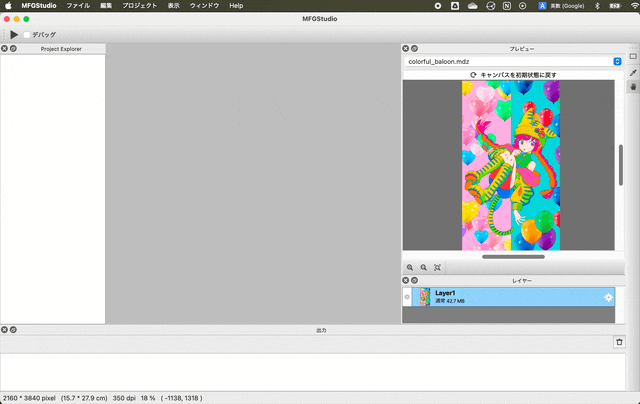

# Installing MFGStudio and checking sample collection

This page explains how to install MFG Studio and basic usage.

## Download Page

[MFG Studio download page](https://modernfilterlanguageforgpu.org/download/)

At this time, we do not have an installer, so please unpack the zip file and place your preference.
Below is a procedure that assumes a typical placement.

## Install on Windows

1. Download the zip file for Windows from the download page
2. Unpack the downloaded zip file (MFGStudio directory is available)
3. Move the MFGStudio directory under Program Files (All it is requested as administrator privileges here)
4. Run MFGStudio.exe

Once launched, right-click on the icon on the taskbar and select "Pin to taskbar" to make it easier to launch it in the future.

### If you are told that some dlls are missing when starting 

Depending on your environment, you may need to install the Microsoft Visual C++ Redistributable Package.
In this case, an error message appears indicating that some dlls are missing when starting, and the program will not start.

In this case, run vc_redist.x64.exe in the MFGStudio folder with administrator privileges, install the "Microsoft Visual C++ Redistributable Package" before starting MFGStudio.exe.

## Install on Mac

1. Download zip for Mac from the download page 
2. Unpack the zip file (MFGStudio.app will be found) 
3. Copy the expanded MFGStudio.app to the Application folder 
4. Double-click MFGStudio.app

## Open Examples Project and operation check

To check whether it was installed correctly, let's open the Examples Project and run it.

1. From the File menu, select "Open Examples Project"
2. Press the Run button on the top left
3. Check the preview in the top right corner to see the mosaic filter running

Try opening and running other filters from ProjectExplorer on the left.

Please note that if you change the language settings, comments and other information will not be updated to the target language unless you re-open the sample collection.