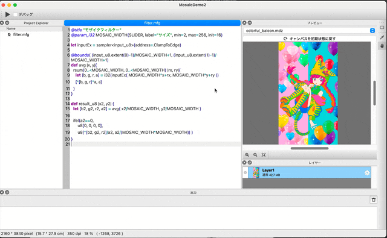

# MFG Documentation Page

[日本語版](../ja/README.md)

Develop filters on GPUs using a modern programming language!

MFG is a programming language designed from scratch to develop image processing filters that run on GPUs.
The design incorporates many of the features of modern programming languages, while also taking into account the uniqueness of GPU programs from the beginning at the core concept stage of the language.

A mosaic filter with multiple kernels and intermediate buffers can be written easily as follows:

```swift
@title "Mosaic Filter"
@param_i32 MOSAIC_WIDTH(SLIDER, label="Size", min=2, max=256, init=16)

let inputEx = sampler<input_u8>(address=.ClampToEdge)

@bounds( (input_u8.extent(0)-1)/MOSAIC_WIDTH+1, (input_u8.extent(1)-1)/MOSAIC_WIDTH+1)
def avg |x, y|{
  rsum(0..<MOSAIC_WIDTH, 0..<MOSAIC_WIDTH) |rx, ry|{
    let [b, g, r, a] = i32(inputEx( MOSAIC_WIDTH*x+rx, MOSAIC_WIDTH*y+ry ))
    [*[b, g, r]*a, a]
  }
}

def result_u8 |x2, y2| {
  let [b2, g2, r2, a2] = avg( x2/MOSAIC_WIDTH, y2/MOSAIC_WIDTH )

  ifel(a2==0,
      u8[0, 0, 0, 0],
      u8[*[b2, g2, r2]/a2, a2/(MOSAIC_WIDTH*MOSAIC_WIDTH)] )
}
```



## MFG Features

- Language created specifically for image processing on GPUs
- Modern program features such as tuples and their destructuring, vectorization, swizzle operators, limited side effects, and highly functional loop processing using blocks
- Language design that focuses on the characteristics of GPU programs such as kernels and global memory at the heart of the language
- The data exchange with paint software and the input UI from the user is included from the beginning
- MFG filters work on FireAlpaca SE 3.0
- Coming soon as open source

## Install MFGStudio

MFG will be developed using MFG Studio.

- [Installaion](Installation.md)

## Getting Started

- [Getting Started](GettingStarted/README.md)

## Reference

- [Reference](Reference/README.md)

