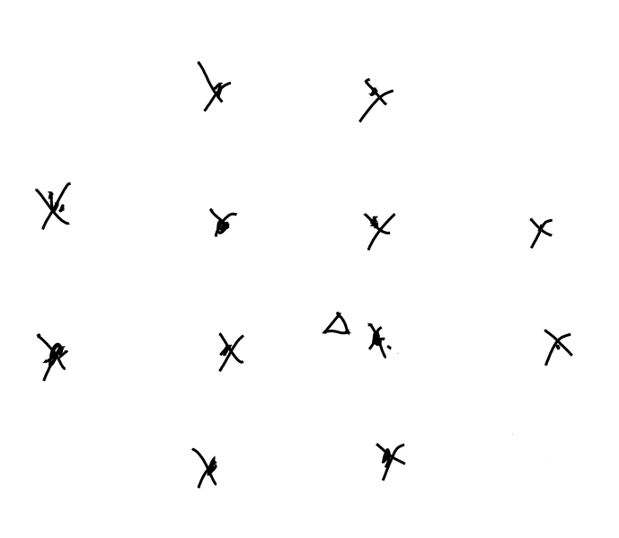
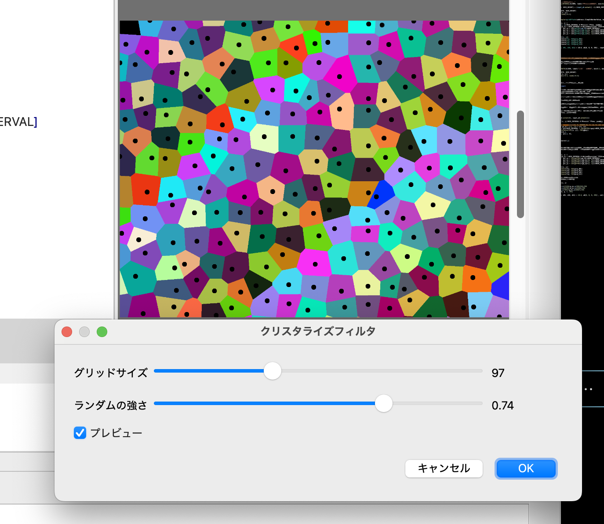
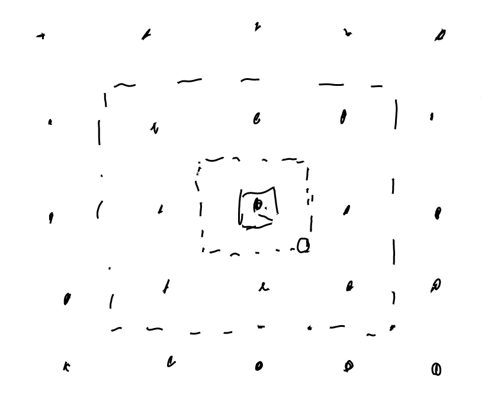
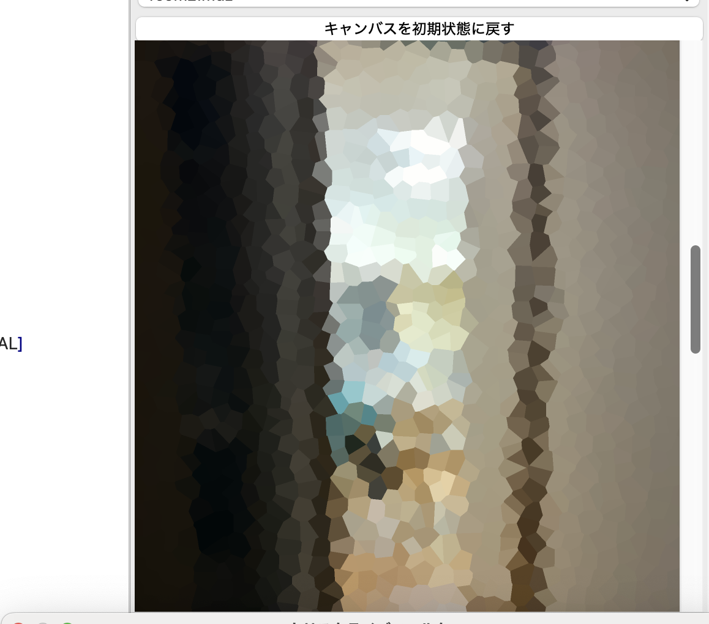

# クリスタライズフィルタ

クリスタライズフィルタが欲しい、というユーザーフィードバックを見かけたので、書いてみる。

## 最初のアルゴリズムを考える

格子点を少しランダムにずらしたモザイク、でそれっぽい振る舞いにはなりそうな気はする。
ただこれだとすべて矩形になってしまう。

図形としてはボロノイ図みたいなものでは無いか、という助言をもらった。

[ボロノイ図 - Wikipedia](https://ja.wikipedia.org/wiki/%E3%83%9C%E3%83%AD%E3%83%8E%E3%82%A4%E5%9B%B3)

確かにそれっぽいので、母点を格子点をランダムにずらしたものとして、それのボロノイ図で領域分けをして、
その領域内は色平均としてみよう。

### 母点の計算

格子間隔を1とした時に、すべての格子を+-0.5で動かす事にしよう。
隣の点と入れ替わる事は無いとする。

[ウォークスルー](../Walkthrough.md)のパーリンノイズと似たような処理で目的の格子は作れそうか？

```swift
@param_i32 GRID_INTERVAL(SLIDER, label="グリッドサイズ", min=10, max=256, init=50)

let [GRID_WIDTH, GRID_HEIGHT] = (input_u8.extent() -1)/GRID_INTERVAL + 1

@bounds(GRID_WIDTH, GRID_HEIGHT)
def gridOffset |x, y|{
  [rand()-0.5, rand()-0.5]
}
```

とりあえずこれをデバッグ表示してみよう。

```swift
@title "クリスタライズフィルタ"
@param_i32 GRID_INTERVAL(SLIDER, label="グリッドサイズ", min=10, max=256, init=50)

let [GRID_WIDTH, GRID_HEIGHT] = (input_u8.extent() -1)/GRID_INTERVAL + 1

@bounds(GRID_WIDTH, GRID_HEIGHT)
def gridOffset |x, y|{
  [rand()-0.5, rand()-0.5]
}

let goffEx = sampler<gridOffset>(address=.ClampToBorderValue, border_value=[0.0, 0.0])

def result_u8 |x, y| {
  let g_xy0 = [x, y]/GRID_INTERVAL # グリッド座標のx, y、左上
  let gs_xy0 = g_xy0 * GRID_INTERVAL # 左上のグリッドの座標をresult_u8スペースに直したもの
  let gs_xy00 =  gs_xy0 + i32(goffEx(*g_xy0)*GRID_INTERVAL)
  let gs_xy01 =  gs_xy0 + i32(goffEx(*(g_xy0+[0, 1]))*GRID_INTERVAL) + [0, GRID_INTERVAL]
  let gs_xy10 =  gs_xy0 + i32(goffEx(*(g_xy0+[1, 0]))*GRID_INTERVAL)  + [GRID_INTERVAL, 0]
  let gs_xy11 =  gs_xy0 + i32(goffEx(*(g_xy0+[1, 1]))*GRID_INTERVAL )+  [GRID_INTERVAL, GRID_INTERVAL]

  let fxy = f32([x, y])
  let d00 = distance(fxy, f32(gs_xy00))
  let d01 = distance(fxy, f32(gs_xy01))
  let d10 = distance(fxy, f32(gs_xy10))
  let d11 = distance(fxy, f32(gs_xy11))

  ifel( min(d00, d01, d10, d11) < 10.0, u8[0, 0, 0, 255] , input_u8(x, y))
}
```

結果は以下。


4点くらいならいいかと同じような処理を4回書いたが意外とデバッグ表示が大変になってしまった。reduceを使う方が良かったかもしれない。

ランダムさは格子が大きくなると大きすぎる気がするな。
ランダムさの強さも選べるようにしておくか。

```swift
@param_f32 STRENGTH(SLIDER, label="ランダムの強さ", min=0.1, max=1.0, init=1.0)

@bounds(GRID_WIDTH, GRID_HEIGHT)
def gridOffset |x, y|{
  STRENGTH*[rand()-0.5, rand()-0.5]
}
```

いい感じになった。

母点は割と自由に作れるようになったかな。

### 最近の母点を探す

各点からもっとも近い母点を探す、という問題をGPUで解く必要がある。
全部の母点を探せば当然見つける事は出来るけれど、
ランダムさの最大を格子間隔の0.5としているので、感覚的には自身のピクセルの周囲4点の、一つ外側くらいを見れば十分な気がする。

少し考えてみたら斜め上と斜め下が近くになる事は無いので、以下のような範囲を見れば良さそう。



プログラム的には面倒なので不要な斜め上と斜め下の点も計算してしまおうか。

左上の点は格子幅で割るだけで計算出来るので、そこを起点にx, yを-1, 0, 1, 2の4通り調べて一番近い点を探せば良いか。

ほとんどは先程の母点を表示するプログラムと同じようなアルゴリズムでできそうだな。
最近接の格子座標のx, yを返すか。

```swift
@bounds(input_u8.extent(0), input_u8.extent(1))
def nn |x, y| {
   let go_xy = [x, y]/GRID_INTERVAL # グリッド座標のx, y、左上

   let nearest = reduce(init=[0, 0, 999999.0], 0..<4, 0..<4) |rx, ry, accm| {
      let gxy = go_xy + [-1, -1] + [rx, ry]
      let ggxy = gxy*GRID_INTERVAL + i32(goffEx(*gxy)*GRID_INTERVAL) # グローバル座標系
      let d = distance(f32([x, y]), f32(ggxy))
      ifel(d <accm.z, 
         [gxy.x, gxy.y, d],
         accm
      )
  }
  [nearest.x, nearest.y]
}
```

結果をデバッグ表示してみる。本当はいい感じの色に色分けしたいところだが、単なる動作確認なので色が違えばいいだろう。
母点もついでに表示しておく方がいいだろう、という事で元のコードに追加する感じにする。

```swift
def result_u8 |x, y| {
  let g_xy0 = [x, y]/GRID_INTERVAL # グリッド座標のx, y、左上
  let gs_xy0 = g_xy0 * GRID_INTERVAL # 左上のグリッドの座標をresult_u8スペースに直したもの
  let gs_xy00 =  gs_xy0 + i32(goffEx(*g_xy0)*GRID_INTERVAL)
  let gs_xy01 =  gs_xy0 + i32(goffEx(*(g_xy0+[0, 1]))*GRID_INTERVAL) + [0, GRID_INTERVAL]
  let gs_xy10 =  gs_xy0 + i32(goffEx(*(g_xy0+[1, 0]))*GRID_INTERVAL)  + [GRID_INTERVAL, 0]
  let gs_xy11 =  gs_xy0 + i32(goffEx(*(g_xy0+[1, 1]))*GRID_INTERVAL )+  [GRID_INTERVAL, GRID_INTERVAL]

  let fxy = f32([x, y])
  let d00 = distance(fxy, f32(gs_xy00))
  let d01 = distance(fxy, f32(gs_xy01))
  let d10 = distance(fxy, f32(gs_xy10))
  let d11 = distance(fxy, f32(gs_xy11))

  # ここまで上の母点表示のコード。
  # ここから近接点による色分け

  let g_nn = nn(x, y)
  # 数字は適当
  let b = (g_nn.x*123456+g_nn.y*7891234)/255
  let g = (g_nn.x*567891+g_nn.y*23456)/255
  let r = (g_nn.x*78912+g_nn.y*34567)/255
  let col = u8[b, g, r, 255]

  ifel( min(d00, d01, d10, d11) < 10.0, u8[0, 0, 0, 255] , col)
}
```

これでできた図が以下。



それっぽくなっている気はする。この時点で割と面白い。

### 同じ母点の領域の色を平均する

[ウォークスルー](../Walkthrough.md)のモザイクと同じような処理を同じ母点の点に対して行えば良さそう。
母点がそれぞれ何かの色を表すようになるので、前回の色分けを、まずはgridごとの色にしてみる。


```swift
@bounds(GRID_WIDTH, GRID_HEIGHT)
def gridCol |x, y|{
  let b = (x*123456+y*7891234)/255
  let g = (x*567891+y*23456)/255
  let r = (x*78912+y*34567)/255
  u8[b, g, r, 255]
}
```

これでresult_u8の最後を以下にする。

```swift
  # ここまで上の母点表示のコード。
  # ここから近接点による色分け

  let g_nn = nn(x, y)
  let col = gridCol(*g_nn)

  ifel( min(d00, d01, d10, d11) < 10.0, u8[0, 0, 0, 255] , col)
```

正しい結果になってそう。
あとはこのgridColをモザイクと同じような処理にすれば良い。

ある母点の足し合わせる範囲の最大の範囲を考えたい。
ある母点がランダムで動く範囲は最大で0.5だ。その一番動いたところでもっとも遠い最近接点の可能性を考えると、
周囲の8個の母点をそれぞれ0.5 intervalだけ広げた矩形になる、かな。



- 内側の破線: 真ん中の母点がずれ得る範囲
- 外側の破線: 対象の母点が最近接になりうるピクセルの範囲

各母点について、この外側の破線の範囲をモザイクの計算をするように平均を取ればいいか。
スクリーン座標系としては、-1.5 gridIntervalから +1.5 gridIntervalの範囲を計算すればいいかな。

```swift
let inputEx = sampler<input_u8>(address=.ClampToEdge)

@bounds(GRID_WIDTH, GRID_HEIGHT)
def gridCol |x, y|{
   let gs_xy0 =  [x, y] * GRID_INTERVAL
   let candW = 3*GRID_INTERVAL
   let [sb, sg, sr, sa, count] = rsum(0..<candW, 0..<candW) |rx, ry|{
      let sxy = gs_xy0+[rx, ry] - i32(1.5*GRID_INTERVAL)*[1, 1]
      let g_nn = nn(*sxy)
      let [b, g, r, a] = i32(inputEx( *sxy ))
      ifel( g_nn.x == x && g_nn.y == y,
         [*[b, g, r]*a, a, 1],
         [0, 0, 0, 0, 0]
      )
   }
  
  ifel(sa==0,
   u8[0, 0, 0, 0],
	u8[*[sb, sg, sr]/sa, sa/count] )
}
```

結果は以下。



良さそう。

最後に全体のスクリプトを載せておく。

```swift
@title "クリスタライズフィルタ"

@param_i32 GRID_INTERVAL(SLIDER, label="グリッドサイズ", min=10, max=256, init=50)
@param_f32 STRENGTH(SLIDER, label="ランダムの強さ", min=0.1, max=1.0, init=1.0)

let [GRID_WIDTH, GRID_HEIGHT] = (input_u8.extent() -1)/GRID_INTERVAL + 1

@bounds(GRID_WIDTH, GRID_HEIGHT)
def gridOffset |x, y|{
  STRENGTH*[rand()-0.5, rand()-0.5]
}

let goffEx = sampler<gridOffset>(address=.ClampToBorderValue, border_value=[0.0, 0.0])

@bounds(input_u8.extent(0), input_u8.extent(1))
def nn |x, y| {
   let go_xy = [x, y]/GRID_INTERVAL # グリッド座標のx, y、左上

   let nearest = reduce(init=[0, 0, 999999.0], 0..<4, 0..<4) |rx, ry, accm| {
      let gxy = go_xy + [-1, -1] + [rx, ry]
      let ggxy = gxy*GRID_INTERVAL + i32(goffEx(*gxy)*GRID_INTERVAL) # グローバル座標系
      let d = distance(f32([x, y]), f32(ggxy))
      ifel(d <accm.z, 
         [gxy.x, gxy.y, d],
         accm
      )
  }
  [nearest.x, nearest.y]
}

let inputEx = sampler<input_u8>(address=.ClampToEdge)

@bounds(GRID_WIDTH, GRID_HEIGHT)
def gridCol |x, y|{
   let gs_xy0 =  [x, y] * GRID_INTERVAL
   let candW = 3*GRID_INTERVAL
   let [sb, sg, sr, sa, count] = rsum(0..<candW, 0..<candW) |rx, ry|{
      let sxy = gs_xy0+[rx, ry] - i32(1.5*GRID_INTERVAL)*[1, 1]
      let g_nn = nn(*sxy)
      let [b, g, r, a] = i32(inputEx( *sxy ))
      ifel( all(g_nn == [x, y]),
         [*[b, g, r]*a, a, 1],
         [0, 0, 0, 0, 0]
      )
   }
  
  ifel(sa==0,
   u8[0, 0, 0, 0],
   u8[*[sb, sg, sr]/sa, sa/count] )
}

def result_u8 |x, y| {
  let g_nn = nn(x, y)
  gridCol(*g_nn)
}
```

nnとgridColを別に求めるのはいかにも無駄そうだけれど、実用出来る程度の速度にはなっているのでまずはシンプルに。