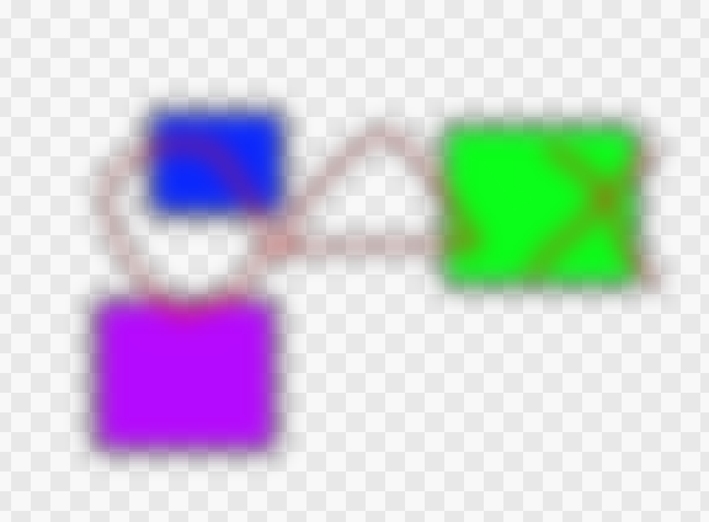
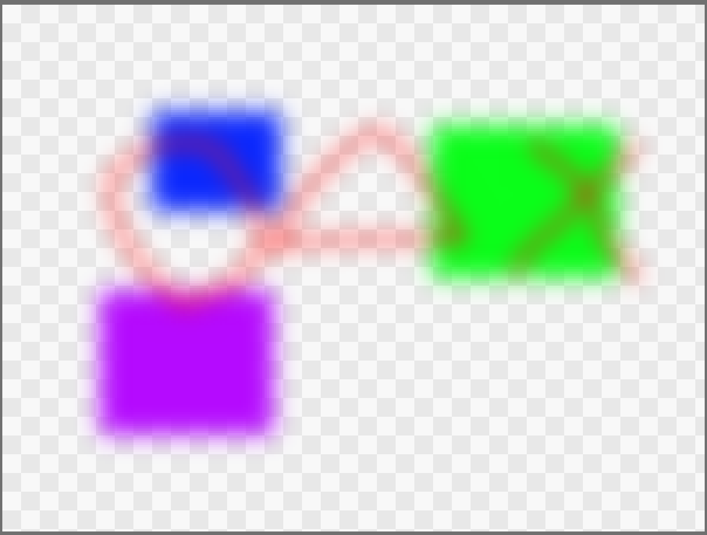
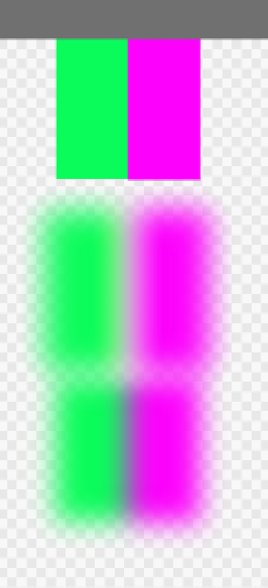

# ガウスぼかし

ガウスぼかしを書いてみたが、高速化や品質向上などいろいろ話題があるので、それらをまとめておく。

2パスにすると早くなると本などには書いてあるが、本当に早くなるかを手元の環境で実験。

4608x3456の写真で、フィルタのサイズ30でベンチマークログで測定。

## ガウスぼかし、1パス版

```cpp
@title "ガウスフィルタ"

@param_i32 ar(SLIDER, label="サイズ", min=2, max=100, init=5)

let clamped = sampler<input_u8>(address=.ClampToEdge)
let sigma = f32(ar)
let WR = 3*ar
# minus WR - 1
let mWR = -(WR-1)

@bounds(WR, WR)
def weight |x, y| {
  exp(- f32(x^2+y^2)/(2.0*sigma^2) )
}

let coeff = rsum(mWR..<WR, mWR..<WR) |rx, ry| { weight(abs(rx), abs(ry)) }

def result_u8 |x, y| {

   let fbgra_res = rsum(mWR..<WR, mWR..<WR) |rx, ry| {
      let fbgra = f32( clamped( x + rx, y+ry) ) / 255.0
      fbgra*weight(abs(rx), abs(ry))
   }
   # u8(min([255, 255, 255, 255], i32(255.0*fbgra_res/coeff) ))
   u8(255.0*fbgra_res/coeff)
}

```

`Flang Filter: 20550 [ms]`

## ガウスフィルタ、2パス版

```cpp

@title "ガウスフィルタ、2パス"

@param_i32 ar(SLIDER, label="サイズ", min=2, max=300, init=5)

let clamped = sampler<input_u8>(address=.ClampToEdge)
let sigma = f32(ar)
let WR = 3*ar
let mWR = -(WR-1)

@bounds(WR)
def weight |x| {
  exp(- f32(x^2)/(2.0*sigma^2) )
}

let coeff = rsum(mWR..<WR) |rx| { weight(abs(rx)) }

let [W, H] = input_u8.extent()
@bounds(W, H)
def xblur |x, y| {
   rsum(mWR..<WR) |rx| {
      let fbgra = f32( clamped( x + rx, y) ) 
      fbgra*weight(abs(rx))
   }
}

let clamped_x = sampler<xblur>(address=.ClampToEdge)

def result_u8 |x, y| {
   let fbgra_res = rsum(mWR..<WR) |ry| {
      clamped_x( x, y+ry)  * weight(abs(ry))
   }
   u8(fbgra_res/(coeff^2))
}

```

`Flang Filter: 13731 [ms]`

おぉ、劇的に早くなった！

ちなみにリリースビルドでCPUで頑張って書いたフィルタと比較すると、

- `Flang Filter: 3076 [ms]`
- `Gaussian Blur: 640 [ms]`

という事でCPUは4.8倍くらい早い。結果が違うので実装を見ると、CPUの方はX方向に3回ぼかしたあとにY方向に3回ぼかしている。＞結果の違いはsigmaを2乗し忘れていたバグとアルファの扱いの違い

## アルファを考慮に入れたガウスぼかし

上記の単純に各色コンポーネントを平均する方法では、半透明と混ぜると暗くなる。

以下の緑のふちとかが黒い。



という事でアルファを考慮に入れたバージョンも作ってみる。

```cpp

@title "ガウスぼかし、アルファ考慮"

@param_i32 ar(SLIDER, label="サイズ", min=2, max=300, init=5)

let clamped = sampler<input_u8>(address=.ClampToEdge)
let sigma = f32(ar)
let WR = 3*ar
let mWR = -(WR-1)

@bounds(WR)
def weight |x| {
  exp(- f32(x^2)/(2.0*sigma^2) )
}

let coeff = rsum(mWR..<WR) |rx| { weight(abs(rx)) }

let [W, H] = input_u8.extent()

let extend = sampler<input_u8>(address=.ClampToEdge)

@bounds(W, H)
def xblur |x, y| {
   let [bs, gs, rs, as] = rsum(mWR..<WR) |rx| {
      let col = to_ncolor(extend( x + rx, y))
      let ga = col.w*weight(abs(rx))
      [*(col.xyz*ga), ga]
   }
   let a = as/coeff
   let bgr = ifel(abs(as) < 0.0001, vec3(0.0), [bs, gs, rs]/as)
   [*bgr, a]
}

let clamped_x = sampler<xblur>(address=.ClampToEdge)

def result_u8 |ix, iy| {
   let ucol = rsum(mWR..<WR) |ry| {
      let col = clamped_x( ix, iy+ry)
      let ga = col.w*weight(abs(ry))
      [*(col.xyz*ga), ga]
   }
   let ga = ucol.w
   let a = ga/coeff
   let nbgr = ifel(abs(ga) < 0.0001, vec3(0.0), ucol.xyz/ga)
 
   to_u8color([*nbgr, a])
}

```



## xyzカラースペースでのガウスフィルタ

RGBよりはxyzの方がいいはずだ、と思い書いてみたが、違いは分からず。一応貼っておく。

```cpp

@title "ガウスフィルタ、xyz空間"

@param_i32 ar(SLIDER, label="サイズ", min=2, max=300, init=10)

let clamped = sampler<input_u8>(address=.ClampToEdge)
let sigma = f32(ar)
let WR = 3*ar
let mWR = -(WR-1)

@bounds(WR)
def weight |x| {
  exp(- f32(x^2)/(2.0*sigma^2) )
}

let coeff = rsum(mWR..<WR) |rx| { weight(abs(rx)) }

let [W, H] = input_u8.extent()
@bounds(W, H)
def xblur |xi, yi| {
   let [zs, ys, xs, as] = rsum(mWR..<WR) |rx| {
      let [b, g, r, a] = f32( clamped( xi + rx, yi) ) /255.0
      let rgb = [r, g, b]
      let x = dot([0.4125, 0.3576, 0.1804], rgb)
      let y = dot([0.2127, 0.7152, 0.0722], rgb)
      let z = dot([0.0193, 0.1192, 0.9502], rgb)

      let ga = a*weight(abs(rx))
      let [x2, y2, z2] =  [x, y, z]*ga
      [z2, y2, x2, ga]
   }
   let a = as/coeff
   let [z, y, x] = ifel(abs(as) < 0.0001, [0.0, 0.0, 0.0], [zs, ys, xs]/as)
   [z, y, x, a]
}

let clamped_x = sampler<xblur>(address=.ClampToEdge)

def result_u8 |xi, yi| {
   let [gz, gy, gx, ga] = rsum(mWR..<WR) |ry| {
      let [z1, y1, x1, a1] = clamped_x( xi, yi+ry)
      let a2 = a1*weight(abs(ry))
      let [z2, y2, x2] = [z1, y1, x1]*a2
      [z2, y2, x2, a2]
   }
   let a = ga/coeff
   let xyz = ifel(abs(ga) < 0.0001, [0.0, 0.0, 0.0], [gx, gy, gz]/ga)
   let r = dot(xyz, [3.2405, -1.5371, -0.4985])
   let g = dot(xyz, [-0.9693, 1.8760, 0.04156])
   let b = dot(xyz, [0.05564, -0.204, 1.0572])  

   u8(min([255.0, 255.0, 255.0, 255.0], 255.0*[b, g, r, a]))
   # u8(255.0*[b, g, r, a])
}

```

## ガンマ補正

ARGBをガンマ補正して足す方が正しいんじゃないか、という事でやってみた。

```cpp

@title "ガウスフィルタ、linRGB"

@param_i32 ar(SLIDER, label="サイズ", min=2, max=300, init=10)

let clamped = sampler<input_u8>(address=.ClampToEdge)
let sigma = f32(ar)
let WR = 3*ar
let mWR = -(WR-1)

@bounds(WR)
def weight |x| {
  exp(- f32(x^2)/(2.0*sigma^2) )
}

let coeff = rsum(mWR..<WR) |rx| { weight(abs(rx)) }

let [W, H] = input_u8.extent()
@bounds(W, H)
def xblur |xi, yi| {
   let [bs, gs, rs, as] = rsum(mWR..<WR) |rx| {
      let bgra = f32( clamped( xi + rx, yi) ) /255.0
      let [linB, linG, linR, linA] = ifel(bgra >= 0.04045,
                                         ((bgra+0.055)/1.055)^2.4, bgra/12.92)
      let ga = linA*weight(abs(rx))
      let g_bgr = [linB, linG, linR]*ga

     [g_bgr.x, g_bgr.y, g_bgr.z, ga]
   }
   let a = as/coeff
   let [b, g, r] = ifel(abs(as) < 0.0001, [0.0, 0.0, 0.0], [bs, gs, rs]/as)
  [b, g, r, a]
}

let clamped_x = sampler<xblur>(address=.ClampToEdge)

def result_u8 |xi, yi| {
   let [gb, gg, gr, ga] = rsum(mWR..<WR) |ry| {
      let [b1, g1, r1, a1] = clamped_x( xi, yi+ry)
      let a2 = a1*weight(abs(ry))
      let [b2, g2, r2] = [b1, g1, r1]*a2
      [b2, g2, r2, a2]
   }
  let linA = ga/coeff
  let [linB, linG, linR] = ifel(abs(ga) < 0.0001, [0.0, 0.0, 0.0], [gb, gg, gr]/ga)
  let linBGRA = [linB,  linG, linR, linA]
  let [b, g, r, a] = ifel(linBGRA>=0.0031308,
                          1.055*linBGRA^(1.0/2.4)-[0.055, 0.055, 0.055, 0.055],
                          12.92*linBGRA)

  u8(min([255.0, 255.0, 255.0, 255.0], 255.0*[b, g, r, a]))
  # u8(255.0*[b, g, r, a])
}

```



真ん中がlinear化、下が通常の何もしてないガウスぼかし。やはりリニア化しないと暗くなってしまって良く無いですね。
ガンマ補正しないと駄目か。

ガンマ補正は良く使うのでビルトインの関数として提供する事にした。
gamma2linearでlinearになおして、計算したあとにlinear2gammaでガンマ補正ありの値に戻す。

それにto_u8colorとto_ncolorも使って書き直したのが以下。（アルファのガンマ補正は不適切だと思ったのでやらないようについでに直した）

```cpp

@title "ガウスフィルタ、linRGB2"

@param_i32 ar(SLIDER, label="サイズ", min=2, max=300, init=10)

let clamped = sampler<input_u8>(address=.ClampToEdge)
let sigma = f32(ar)
let WR = 3*ar
let mWR = -(WR-1)

@bounds(WR)
def weight |x| {
  exp(- f32(x^2)/(2.0*sigma^2) )
}

let coeff = rsum(mWR..<WR) |rx| { weight(abs(rx)) }

let [W, H] = input_u8.extent()
@bounds(W, H)
def xblur |xi, yi| {
   let [bs, gs, rs, as] = rsum(mWR..<WR) |rx| {
      let bgra = to_ncolor( clamped( xi + rx, yi) )
      let [linB, linG, linR] = gamma2linear(bgra.xyz)
      let A = bgra.w
      let ga = A*weight(abs(rx))
      let g_bgr = [linB, linG, linR]*ga

     [g_bgr.x, g_bgr.y, g_bgr.z, ga]
   }
   let a = as/coeff
   let [b, g, r] = ifel(abs(as) < 0.0001, [0.0, 0.0, 0.0], [bs, gs, rs]/as)
  [b, g, r, a]
}

let clamped_x = sampler<xblur>(address=.ClampToEdge)

def result_u8 |xi, yi| {
   let [gb, gg, gr, ga] = rsum(mWR..<WR) |ry| {
      let [b1, g1, r1, a1] = clamped_x( xi, yi+ry)
      let a2 = a1*weight(abs(ry))
      let [b2, g2, r2] = [b1, g1, r1]*a2
      [b2, g2, r2, a2]
   }
  let a = ga/coeff
  let [linB, linG, linR] = ifel(abs(ga) < 0.0001, [0.0, 0.0, 0.0], [gb, gg, gr]/ga)
  let [b, g, r] = linear2gamma([linB, linG, linR])
  to_u8color([b, g, r, a])
}
```


CIELabでもやってみたい気もするが、思ったが変換が面倒なので、手つかず。後発のOKLabでやってみるのがいいかもしれない。

[A perceptual color space for image processing](https://bottosson.github.io/posts/oklab/)