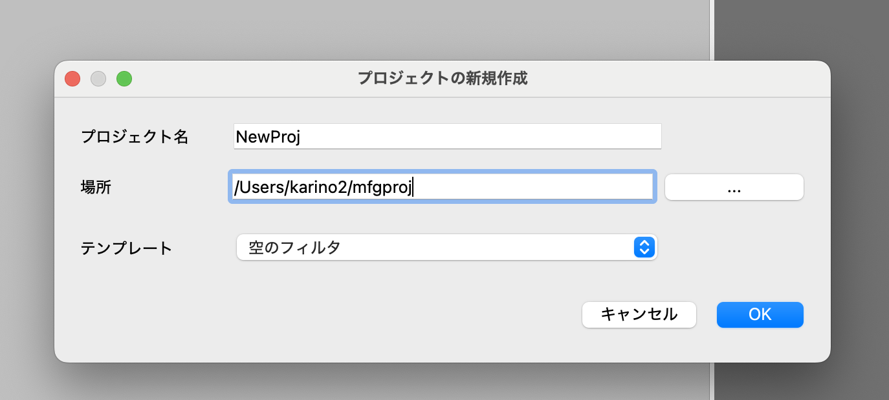
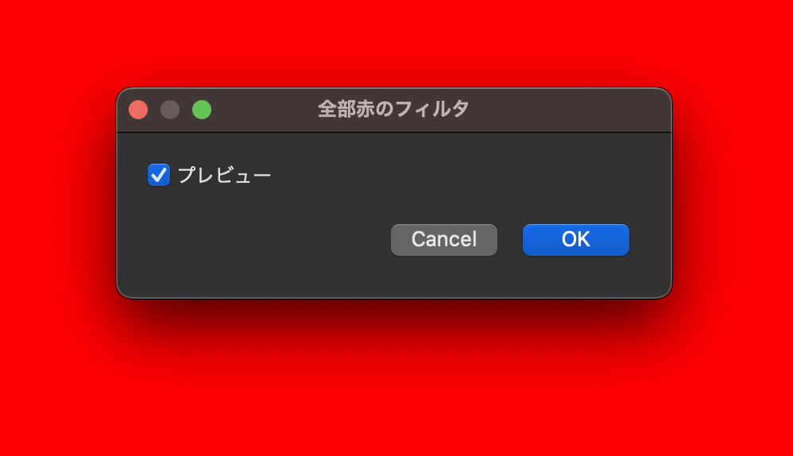

# 01 ハローMFG

MFGでフィルタを書いてみましょう。
このページでは、以下の事を学びます。

- プロジェクトの作成方法
- すべて赤のフィルタの作り方
- x, yを使ってグラデーション
- タイトルの指定

ではさっそく見ていきましょう。

## AllRedプロジェクトの作成

MFGStudioでは、フィルタをプロジェクトという単位で管理します。
一つのフィルタにつき一つのプロジェクトを作るのが基本となります。

そこで初めてのフィルタを作成するにあたり、AllRedプロジェクトを作成してみましょう。

ファイルメニューから「プロジェクト新規作成」を選びます。

すると以下のようなダイアログが表示されるはずです。



ここでは以下のように設定しましょう。

- プロジェクト名: AllRed
- 場所: これはプロジェクトのディレクトリを置きたい場所、好きな場所を選んでもらってOK
- テンプレート: 空のフィルタ

そしてOKを押すと以下のような画面になると思います。


### AllRedプロジェクトで作られるもの

初めてのプロジェクト作成なので、先に進む前に簡単に構成要素を見ておきましょう。

まず、AllRedというディレクトリが「場所」で指定したディレクトリに作られます。これはExplorerやFinderなどで確認してみてください。

MFGStudioでは、プロジェクトを開いている状態では、タイトルバーがプロジェクト名になります。この場合は「AllRed」というタイトルバーになっているのを確認してください。

そしてMFGStudioのプロジェクトの新規作成では、filter.mfgというファイルが一つ、作られます。
そして作成時に自動でこのファイルを開きます。

以後はこのfilter.mfgファイルを編集していく事になります。

なお、テンプレートで空白を選ぶとネガポジ反転のフィルタのコードになります。

以下のような内容です。

```mfg
@title "(New Filter)"

def result_u8 |x, y| {
  #
  # please modify code here.
  #
  let [b, g, r, a] = input_u8(x, y)
  u8[255-b, 255-g, 255-r, a]

}
```

この中身についてはこのあとで解説してきます。

## 全部赤のフィルタ

無事AllRedプロジェクトが作れたら、次は実際にフィルタを書いてみましょう。初めてのMFGプログラミングです。

MFGで一番カンタンなプログラムというと、すべて同じ色で塗りつぶすフィルタとなります。
ここでは、全部赤に塗りつぶすフィルタを書いてみましょう。


そこに以下を書きます。

```mfg
def result_u8 |x, y| {
  u8[0, 0, 0xff, 0xff]
}
```

実行してみましょう。


これで全部赤に塗りつぶすフィルタが出来ました。

以下、上記のコードの詳細を見ていく事から始めます。

### result_u8テンソルで結果の画像を生成

MFGは、基本的にはテンソルの生成を並べる事でフィルタとします。テンソルはさしあたって画像を二次元のピクセルの集まりとして見たもの、と思っておいて良いでしょう。

そしてMFGのフィルタはいつも、最終的には「result_u8」という名前のテンソルを生成する必要があり、これがフィルタ結果の画像となります。

テンソルの定義は以下のように行います。

```mfg
def result_u8 |x, y| {
   何かの式
}
```

### テンソルは、聞かれた座標の点の色を返す事で生成する

MFGでは、「このx, yの色はなんですか？」と聞いてきた事に対して、その色を返す事でテンソルを生成します。

MFGはGPUで動く事を前提とした言語なので、CPUのプログラム言語に慣れた人にはわかりにくい所がここです。自分から点を打つのでは無く、聞かれた座標の色を返さないといけません。

どの点についてかは、この場合はx, yに座標が入っていますが、今回はすべて赤に塗りつぶすという事で座標に関係なく赤を返すので使っていません。

赤、というのは以下のようになっています。

```mfg
u8[0, 0, 0xff, 0xff]
```

`u8[]`は中のものをu8としてみなしたベクトルとする、という意味です。現時点ではresult_u8の最後はいつもこれにする、と覚えてしまってもいいでしょう。

順番はBGRAの順番です。この場合は赤成分とα成分が0xffで他は0という意味で、全体で赤を表します。

なお、コメントアウトはシャープで、シャープより後は行末まで無視されます。だから以下のようにすると、色は緑になるでしょう。

```mfg
def result_u8 |x, y| {
  # u8[0, 0, 0xff, 0xff]
  u8[0, 0xff, 0, 0xff]
}
```

### xとyを使ってグラデーションにしてみる

さて、ここまではxとyを使っていませんでした。

せっかくなのでxとyを使ってみましょう。とりあえずxが100ピクセル単位でグラデーションのように赤の度合いを強めるようにしてみましょう。

```mfg
def result_u8 |x, y| {
  u8[0, 0, (0xff*x)/100, 0xff]
}
```

すると以下のようになります。


### やってみよう: y座標も使う

返す色を以下のようにyも使ってみるとどうなるでしょうか？

```mfg
u8[0, (0xff*y)/100, (0xff*x)/100, 0xff]
```

### タイトルもつけよう

現時点ではフィルタを実行した時のダイアログのタイトルが「(New Filter)」と表示されています。これを「全部赤のフィルタ」というタイトルに変えてみましょう。

フィルタのダイアログを指定するには `@title` というのを使います。

以下の部分を

```mfg
@title "(New Filter)"
```

以下のように書き換えてみましょう。


```mfg
@title "全部赤のフィルタ"
```

すると以下のようになります。



ダイアログのタイトルが「全部赤のフィルタ」になっている事を確認してください。

なお、このアットマークで始まるものは「attribute」と呼んでいます。

## この章のまとめ

ここまで学んだ事を簡単にまとめておきましょう。

- MFGではテンソルの定義を並べる事でフィルタを作る
- result_u8という特別な名前のテンソルが最終結果を表す
- `u8[]`で色をつくる
- `@title` でダイアログのタイトルを指定できる

## 次回

[02 入力と基本的な演算](02_Basic.md)