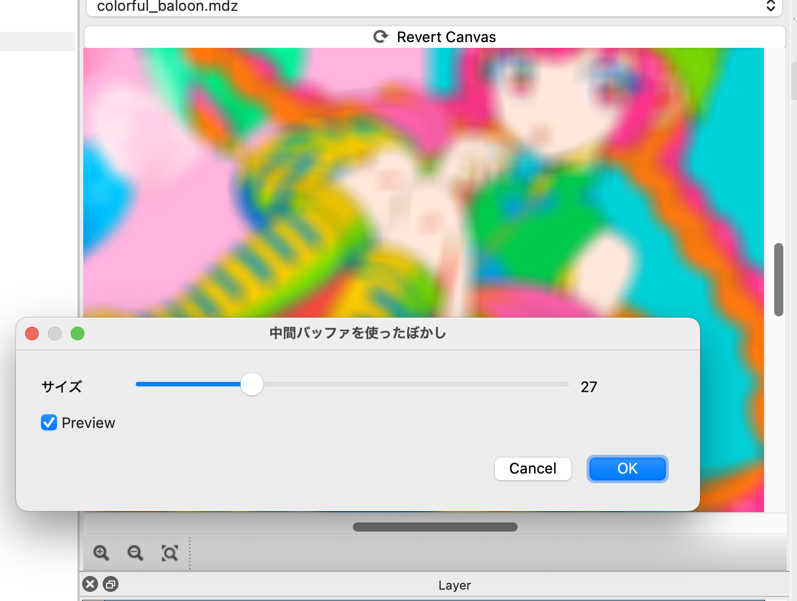

# 04 中間テンソルを使った複雑なアルゴリズムの実現

前回: [03 ベクトライズ演算とrsum](03_VectorRsum.md)

ここまで、生成するテンソルはresult_u8のみでした。

ここでは中間テンソルを生成する事で、2パス以上のアルゴリズムを実現する方法を見ていきます。
各テンソルごとにGPUプログラム用語でいう所のカーネルが生成されるため、
タイムアウトなどの対策にもなります。

## 2パスのぼかし処理

[前回](03_VectorRsum.md)実装したぼかし処理は、周辺の計算を再利用する事で高速化の余地があります。

ここでは簡単に、水平に平均をとった結果を一旦保存し、それを縦に平均するように変更しましょう。

中間テンソルを作るのはほとんとresult_u8の作り方と変わりませんが、幅と高さを指定する必要がある所だけが違います。

コードとしては以下のようになります。

```swift
let inputEx = sampler<input_u8>(address=.ClampToEdge)

@bounds(input_u8.extent(0), input_u8.extent(1))
def xblur |x, y| {
  let sumCol = rsum(0..<3) |rx| {
    i32(inputEx(x+rx-1, y))
  }
  sumCol/3
}
```

このようにすると、xblurという名前のテンソルが生成されます。幅と高さは入力のレイヤーと同じサイズとなります。
sumColはi32の4要素のベクトルとなるので、xblurもi32の4要素のベクトルとなります（u8では無い事に注意）

なお、input_u8.extentを二回書く代わりに、以下のようにも出来ます。

```swift

let inputEx = sampler<input_u8>(address=.ClampToEdge)

let [W, H] = input_u8.extent()

@bounds(W, H)
def xblur |x, y| {
  let sumCol = rsum(0..<3) |rx| {
    i32(inputEx(x+rx-1, y))
  }
  sumCol/3
}
```

## xblurのコードを見ていく

では具体的に中間テンソルの生成のコードを見ていきましょう。

まずテンソルの定義は、幅と高さを指定する `@bounds` で始まります。

```swift
@bounds(W, H)
def xblur 
```

これがxblurの幅と高さになります。

テンソルの定義はほとんどresult_u8と同様ですが、結果の型は自由に選べます。
コードとしては以下のようになっています。

```swift
def xblur |x, y| {
  let sumCol = rsum(0..<3) |rx| {
    i32(inputEx(x+rx-1, y))
  }
  sumCol/3
}
```

result_u8と同様に、0から幅と高さまで、xとyを1ずつ増やしてこのブロックを実行していきます。
この実行はGPUで並列に実行されます。

一つのテンソルの生成が、GPU用語でいう所の一つのカーネルとなります。
GPUの処理は長すぎるとタイムアウトしますが、複数カーネルに分ければ各カーネルの実行時間が短ければタイムアウトになりません。

xblurは内部的にはグローバルなDRAMのメモリが確保されて、そこに保存される事になります。

それ以外はresult_u8の定義と同様と思います。

## xblurを使ってぼかし処理を書いてみる。

水平方向に足したものを垂直方向に足して平均を取るとぼかしになります。
その処理を実際に行ってみましょう。

xblurを足し合わせるのに境界の外をClampToEdgeにしておくと良い事に注意すれば、以下のようになります。

```swift
@title "中間バッファを使ったぼかし"

let inputEx = sampler<input_u8>(address=.ClampToEdge)

let [W, H] = input_u8.extent()

@bounds(W, H)
def xblur |x, y| {
  let sumCol = rsum(0..<3) |rx| {
    i32(inputEx(x+rx-1, y))
  }
  sumCol/3
}

let xblurEx = sampler<xblur>(address=.ClampToEdge)

def result_u8 |x, y| {
  let sum = rsum(0..<3) |i| {
    xblurEx(x, y+i-1)
  }
  u8(sum/3)
}
```

こちらの方がパフォーマンスが早くなります。
3x3程度ではそれほどの高速化になりませんが、もう少し範囲を大きくすると違いは顕著になります。

## 幅をスライダーWidgetで変更出来るようにする

ここまで、足し合わせる範囲を3x3に限定していました。
けれど普通はぼかしフィルタといえば、ぼかす度合いをスライダーで指定したいと思います。

そこでスライダーWidgetを使ってユーザーの入力を受け取ってみましょう。

スライダーウィジェットを使うには、`@param_i32`というものに`SLIDER`を指定します。
以下のように使います。

```swift
@param_i32 BLUR_WIDTH(SLIDER, label="サイズ", min=2, max=100, init=5)
```

こうすると、実行した時にダイアログにスライダーが表示されて、選ばれた数字が `BLUR_WIDTH` という変数に入る事になります。
min, max, initなどいろいろ指定出来ますが、まずはそのまま使って変えたい所だけ調整するのがいいでしょう。

これを使ってBLUR_WIDTHという変数にぼかしの幅を入れたら、先程までrsumでハードコードで指定していた数値をこれに置き換えればOKです。

結果だけ書くと以下のようになります。

```swift
@title "中間バッファを使ったぼかし"

@param_i32 BLUR_WIDTH(SLIDER, label="サイズ", min=2, max=100, init=5)

let inputEx = sampler<input_u8>(address=.ClampToEdge)

let [W, H] = input_u8.extent()

@bounds(W, H)
def xblur |x, y| {
  let sumCol = rsum(0..<BLUR_WIDTH*2+1) |rx| {
    i32(inputEx(x+rx-BLUR_WIDTH, y))
  }
  sumCol/(2*BLUR_WIDTH+1)
}

let xblurEx = sampler<xblur>(address=.ClampToEdge)

def result_u8 |x, y| {
  let sum = rsum(0..<BLUR_WIDTH*2+1) |i| {
    xblurEx(x, y+i-BLUR_WIDTH)
  }
  u8(sum/(2*BLUR_WIDTH+1))
}
```

実行すると以下のようになります。



これで立派なぼかしフィルタが出来ました。

## この章のまとめ

- 中間テンソルは `@bounds` で幅と高さを指定する必要がある以外はresult_u8と同様
- 中間テンソルはu8のベクトル以外も作る事が出来る
- 中間テンソルはGPU的には別のカーネルになる
- `@param_i32` でスライダーで入力を受け取る事が出来る

## さらに学びたい人へ

ここまででGetting Startedは終了となります。

ここから先はMFGStudioのファイルメニューにある「サンプル集」に多くのサンプルがあります。

また[リファレンス](../Reference/)にはさらに詳細な解説があります。