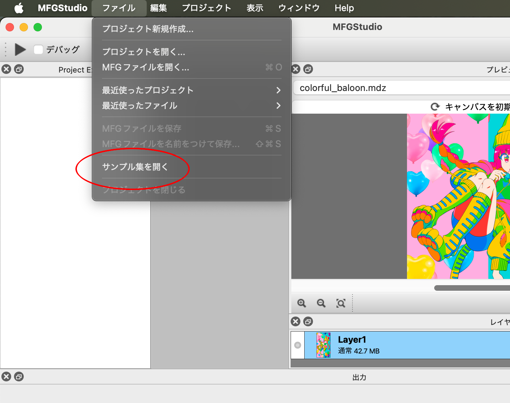
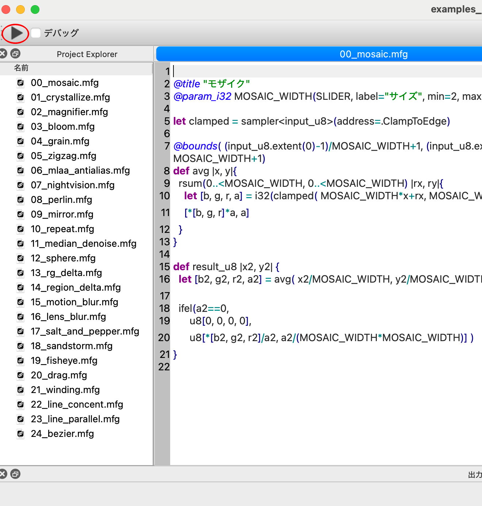

# MFGStudioのインストールとサンプル集の確認

このページでは、MFGStudioのインストールと簡単な使い方を解説します。

## ダウンロードページ

[MFG Studioのダウンロードページ](https://modernfilterlanguageforgpu.org/download/)

現時点では特にインストーラーなどは用意していないので、zipを展開してお好みの場所においてください。
以下には典型的な置き場所を想定した手順を書いておきます。

## Windowsでのインストール

1. ダウンロードページからWindows用のzipファイル（MFGStudioWin32.zip）をダウンロードする
2. MFGStudioWin32.zipを展開する
3. Program Filesの下にMFGStudioディレクトリを移動する（ここで管理者権限を求められるので許可する）
4. MFGStudio.exeを実行する

起動したら、タスクバーのアイコンを右クリックして、「タスクバーにピン留めする」を選ぶと以後の起動が簡単になります。

### 起動時にdllが足りない等言われる場合

環境によっては、「Microsoft Visual C++再頒布可能パッケージ」をインストールする必要がある場合があります。この場合、起動時にdllが足りない、という主旨のエラーメッセージが出て起動しません。

この場合はMFGStudioフォルダ内にあるvc_redist.x64.exeを管理者権限で実行し、「Microsoft Visual C++再頒布可能パッケージ」をインストールしてからMFGStudio.exeを起動してください。

## Macでのインストール

1. ダウンロードページからMac用のzip（MFGStudioMac.zip）をダウンロード
2. MFGStudioMac.zipを展開
3. 展開したフォルダにあるMFGStudio.appをApplicationフォルダにコピー
4. MFGStudio.appをダブルクリック

## サンプル集と動作の確認

正しくインストールされたかを書くにするために、サンプル集を開いて実行してみましょう。

1. メニューのファイルから、「サンプル集を開く」を選ぶ
2. 左上の実行ボタンを押す
3. モザイクフィルタが実行されるのを右上のプレビューで確認

以下にスクリーンショットも貼っておきます。

**「サンプル集を開く」のメニュー**

**左上の実行ボタン**

モザイクの他のフィルタも、左のProjectExplorerから開いて実行してみてください。

なお、言語設定を変更した場合、「サンプル集を開く」をもう一度行わないとコメントなどが対象の言語に更新されないので、注意してください。

