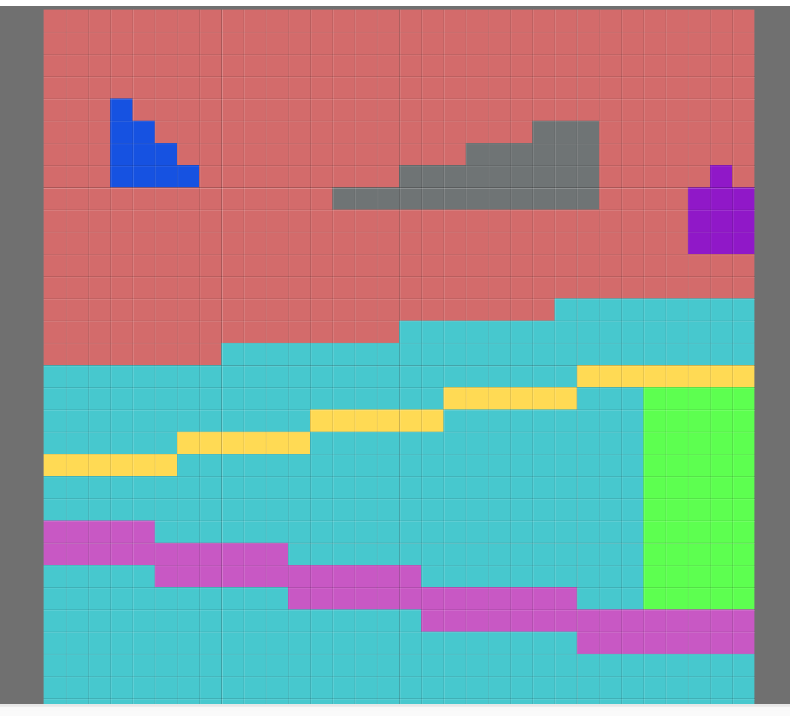
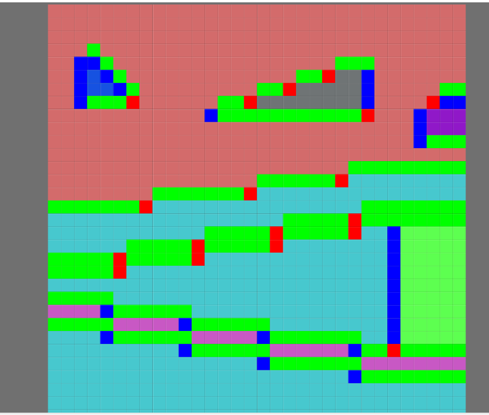

# MLAAフィルタ

Morphological Antialiasing、略してMLAAを実装していく。

## 参考文献

- [Morphological antialiasing - Proceedings of the Conference on High Performance Graphics 2009](https://dl.acm.org/doi/abs/10.1145/1572769.1572787)
- [Morphological Antialiasing - Real-Time Rendering](https://www.realtimerendering.com/blog/morphological-antialiasing/)

## 基本的なアイデアと実装方針

もともとの論文はCPU用なので、GPUのために幾つか変更が必要になる。
そういう事も踏まえて、何を実装したのかのメモを残しておく。

通常のアンチエイリアスというのは境界がボケてしまうが、
形状を意識した賢いアンチエイリアスを実装する事で、エイリアスっぽい所はキレイにしつつ、
そうでない所はぼやかさない、というのがMLAAの基本的なアイデアです。

上記の論文が嚆矢となり、その後多くの関連研究がなされましたが、ここでは一番基本的なアイデアを実装してみます。

基本的なアイデアとしては、色が大きく変わる所をエッジとした時に、
その境界のパターンが幾つかに分けられて、そのうちL字の内側だけを補完すると良い、
というのが基本的なアイデアになります。

今回の実装は、なるべく論文のアイデアをそのままにシンプルに実装して、
細かい挙動を調べる為のベースラインになるような実装を目指します。

### 色の差分と補完の式の変更

色の差分については、ガンマ補正を考慮してリニアライズしたRGB空間の単純な距離としました。
距離を判定するにはより優れた色空間を使う方が良いですが、最初の基礎となるバージョンとして一番簡単な実装にしました。

もとの論文では色の連続性を保つように一次方程式を解いていましたが、
今回は論文の白黒のアルゴリズムと同様に、単純に距離で台形の面積を求めて比率とします。

### エッジの長さの上限

もとの論文ではエッジの長さに特に制限は無かったけれど、
GPU実装のために最大のサイズを決めてしまう事にします。
最大のサイズは7としています。

## エッジの検出

最初に、隣あうピクセルで色が大きく変わる所を探します。
隣接するピクセル同士は境界を共有するため、片方だけ保持していけば十分。

ピクセルの下と右のエッジだけを保持する事にし、一番下の行と一番右の列のデータは持たない事にする。

するとテンソルとしては`@bounds( (input_u8.extent(0)-1), (input_u8.extent(1)-1))` の範囲となる。

結果は2要素のベクトルで良いのだけれど、u8v2は環境によってはi32の2要素ベクトルにされてしまう事があるので、
確実にi32にパックされるu8v4を使う。

ガンマ補正をリニアライズした色をLのsuffixで表すと、x, yの点の色は

```mfg
   let col0 = to_ncolor(input_u8(x, y))
   let col0L = [*gamma2linear(col0.xyz), col0.w]
```

のように表せる。
これを用いると、以下のようになる。

```mfg
let DIFF_THRESHOLD= 1.0/12.0 # これ以上RGB距離があればedgeとみなす。

# u8[bottom, right, 0, 0]を返す。
@bounds( (input_u8.extent(0)-1), (input_u8.extent(1)-1))
def edge |x, y|{
   let col0 = to_ncolor(input_u8(x, y))
   let col0L = [*gamma2linear(col0.xyz), col0.w]

   let colRight = to_ncolor(input_u8(x+1, y))
   let colBottom = to_ncolor(input_u8(x, y+1))
   let colRightL = [*gamma2linear(colRight.xyz), colRight.w]
   let colBottomL = [*gamma2linear(colBottom.xyz), colBottom.w]

   let eb = distance(colBottomL, col0L) > DIFF_THRESHOLD
   let er = distance(colRightL, col0L) > DIFF_THRESHOLD

   # 今の所u8v2よりu8v4の方が最適化が効くのでu8v4にしておく。
   u8[eb, er, 0, 0]
}
```

デバッグの為に、エッジの立っている所を適当な色にしてみる。

```
let edgeEx = sampler<edge>(address=.ClampToEdge)

def result_u8 |x, y| {
  let einfo = edgeEx(x, y)
  ifel(einfo.x&&einfo.y,
        u8[0, 0, 0xff, 0xff],
        ...)
   elif(einfo.x,
        u8[0, 0xff, 0, 0xff],
        ...)
    elif(einfo.y,
         u8[0xff, 0, 0, 0xff],
         ...)
    else(input_u8(x, y))     
}
```

| **適用前画像** | **エッジに色づけした画像** |
|------|-----|
| |  |


## 最終コード

エッジの長さなど、やる事は多いが、ひとまずコメントに書いておく。


```
@title "MLAA"

let EDGE_MAX_LENGTH = 7
let END_FOUND_MASK = i32(0x80)
let DIFF_THRESHOLD= 1.0/12.0 # これ以上RGB距離の差分があればedgeとみなす。

# 色が大きく変わる所をエッジとみなして、それの垂直方向と水平方向を各ピクセルで計算する。
# エッジは２つのピクセルで共有されるので、片方だけ計算すれば十分
# そこで下と右のエッジだけを計算する。
# エッジは、その方向と垂直のエッジとぶつかるとそこで終わりとみなされる。
# 水平方向のエッジの長さを調べるには、上下を見ていくだけでは以下のようなケースがうまく扱えない。
#
# xxoooo
# ooxxxx
# 
# このように上下の色が入れ替わった時にはエッジは終わって欲しいが、これは上下の差分だけでは不十分で、
# 垂直方向のエッジと交差しているかを見る必要がある。
# そこでまず下と右の辺がエッジになっているかだけを抜き出して、その情報を元に長さを計算する、
# という2パスにする。
# まずは1パス目の下と右の辺がエッジになっているかを計算してedgeと呼ぶ。
# u8[bottom, right, 0, 0]を返す。
@bounds( (input_u8.extent(0)-1), (input_u8.extent(1)-1))
def edge |x, y|{
   let col0 = to_ncolor(input_u8(x, y))
   let col0L = [*gamma2linear(col0.xyz), col0.w]

   let colRight = to_ncolor(input_u8(x+1, y))
   let colBottom = to_ncolor(input_u8(x, y+1))
   let colRightL = [*gamma2linear(colRight.xyz), colRight.w]
   let colBottomL = [*gamma2linear(colBottom.xyz), colBottom.w]

   let eb = distance(colBottomL, col0L) > DIFF_THRESHOLD
   let er = distance(colRightL, col0L) > DIFF_THRESHOLD

   # 今の所u8v2よりu8v4の方が最適化が効くのでu8v4にしておく。
   u8[eb, er, 0, 0]
}


# let edgeEx = sampler<edge>(address=..ClampToBorderValue, border_value=u8(vec4(0)))
let edgeEx = sampler<edge>(address=.ClampToEdge)

# edgeLenの計算
#
# edgeを元に、各ピクセルの水平方向と垂直方向のエッジの長さを数える。
# 説明のため水平方向に限定して話をする。
# エッジは対象のピクセルを0として、ネガティブ方向とポジティブ方向にどれだけあるか、という数字として持つ。
# そして終わりを見つけた方向ではEND_FOUND_MASKのビットを立てる
# 例えば対象のピクセルしかエッジが無いケースではposもnegも0でEND_FOUND_MASKが1になるので、
# 0x80, 0x80となる。
# negが1, posが3なら 0x81, 0x83 となる。
# 最大の長さ7まで見つけても終わりが見つからなければ0x07となる。この場合はEND_FOUND_MASKが立たない。
#
# エッジの終わりはedgeが0になるだけでは無く、垂直方向のエッジと交差する場合もある。
# 真ん中から左に向かうケースを考えると、エッジは以下の通りがある。
#
# 1.
# xxoooo
# xxxxxx
#
# 2.
# oooooo
# ooxxxx
#
# 3.
# xxoooo
# ooxxxx
#
# 1と2は水平方向のedgeだけ見ていけばいいが、3を判定するには垂直方向を見る必要がある
# 逆に左のエッジがあれば必ずそこで水平方向negative（水平左方向）のエッジは終わりとみなされる。
# 長さだけなら2と3を区別する必要は無いので、2段目のupperを計算している時には一段目のleftを見る必要は無く
# 2段目のleftだけで十分な事に注意。
#
# これを水平方向positiveと垂直方向のnegative, positiveと3種類同じような事を考える必要がある。
# 水平方向positiveは右側のエッジが立っているかを見る。
#  垂直方向negativeは上のエッジが立っているか、垂直方向positiveは下のエッジが立っているかを見る。
# エッジは上と左だけなので、下は一つ下のピクセルの上、右は一つ右のピクセルの左を見る事になる。
# 境界は厳密には直行する方向のエッジは0になり、同じ方向のエッジはborder valueになるのが望ましいが、
# 直行するエッジの値が間違っていても影響は無いはずなので、ClampToEdgeにしてしまう。
#
# 今回もあるピクセルの下のエッジとその下のピクセルの上のエッジは同じ長さとなるので、
# 下と右だけ計算する。ただposとnegがそれぞれあるので、
# u8[bottomNeg, bottomPos, rightNeg, rightPos]
# となる。
@bounds( (input_u8.extent(0)-1), (input_u8.extent(1)-1))
def edgeLen |x, y|{
   # まずはbottomとrightで区切りが計算出来る、
   # bottomPosとrightPosを計算する
   # accm は
   # 1.  初期状態0
   # 2. 最初のピクセルがそもそもエッジじゃなかった-1
   # 3. 現在のBottomPosとRightPosの長さ+END_FLAG
   # の3通りの値を持つ
   let eLenBRPos0 = reduce(init=[0, 0], 0..<EDGE_MAX_LENGTH+1) |i, accm|{
     # 水平方向(bottom)のposを考える
     # bottomが右にどれだけ続くかを数えるが、rightとぶつかったら終わり。
     #
     # 直行するエッジとぶつかるかエッジが終わればENDとみなす。
     # reduceの範囲を超えた場合だけそのままENDフラグが立たずに終わる。

     let edgeBP = edgeEx(x+i, y)
     let edgeRP = edgeEx(x, y+i)

     let curEdge = [edgeBP.x, edgeRP.y]
     let curOrtho = [edgeBP.y, edgeRP.x]

     let alreadyEnd = (accm & END_FOUND_MASK) != 0
     let prevEnd = (curEdge == 0)
     let curEnd = (curOrtho != 0)

     ifel(alreadyEnd,
         accm,
         ...)
      elif(i == 0,
         ifel(curEdge,
               ifel(curEnd,
                  [0, 0] | END_FOUND_MASK ,
                  [0, 0]
               ),
              # accmは最初のPixelがそもそもエッジじゃなければ-1にする。
              # これはalreadyEndの条件も満たすのでそれ以後は-1になる。
               [-1, -1]),
         ...)
      elif(prevEnd, # iが0でもなくまだalreadyEndでも無い（これはaccmが-1でない、も含む）
              accm|END_FOUND_MASK,
              ...)
      elif(curEnd, 
              (accm+1)|END_FOUND_MASK,
              accm+1
              )
   }


   # 次にとなりのピクセルの直行するエッジを調べる必要がある、
   # bottomNegative, rightNegativeの計算。
   let eLenBRNeg0 = reduce(init=[0, 0], 0..<EDGE_MAX_LENGTH+1) |i, accm2|{
     # 水平方向(bottom)のnegを考える
     # bottomが左にどれだけ続くかを数えるが、leftとぶつかったら終わり。
     # leftは次のrightとなる。だから遡って現在のrightがあれば一つ前で終わらせる必要がある。

     let edgeBN = edgeEx(x-i, y)
     let edgeRN = edgeEx(x, y-i)

     let curEdge = [edgeBN.x, edgeRN.y]
     let curOrtho = [edgeBN.y, edgeRN.x]
     
     let alreadyEnd = (accm2 & END_FOUND_MASK) != 0
     let prevEnd = (curOrtho != 0) || (curEdge == 0)

    # 良く見ると一つ上のreduceとの違いはprevEndとcurEndの所だけだと分かる。
    # 工夫すれば一つにまとめられそうだが、結局DRAMアクセスの回数は変わらないので速度は大差なさそう。
     ifel(alreadyEnd,
         accm2,
         ...)
      elif(i == 0,
         ifel(curEdge,
               [0, 0],
              # accmは最初のPixelがそもそもエッジじゃなければ-1にする。
              # これはalreadyEndの条件も満たすのでそれ以後は-1になる。
               [-1, -1]),
         ...)
      elif(prevEnd, # iが0でもなくまだalreadyEndでも無い（これはaccmが-1でない、も含む）
              accm2|END_FOUND_MASK,
              accm2+1)
   }

   # u8[bottomNeg, bottomPos, rightNeg, rightPos]になるように並べる
   let eLen0 = [eLenBRNeg0.x, eLenBRPos0.x, eLenBRNeg0.y, eLenBRPos0.y]
   let eLen = ifel(eLen0 == -1, [0, 0, 0, 0], eLen0)
   u8(eLen)
}


let edgeLenEx = sampler<edgeLen>(address=.ClampToBorderValue, border_value=u8(vec4(0)))
let inputEx = sampler<input_u8>(address=.ClampToEdge)
)"
R"(
#
# 現在のピクセルを周囲のピクセルとどう補完するかをedgeLenから考える。
# 補完はいつも、L型の内側のピクセルだけ行う事にする
# L字への分割方法はあとで説明する（論文の通り）
# 
# まずはbottomのnegative側の補完を考える。
# 自身のピクセルがCの位置だとして、
# 以下の2通りが考えられる。
# ここでoとxはo同士、x同士が色が近くてoとxが遠ければいいだけなので対照。どちらが濃いとかは無い
#
# ケース1:
# ooooCoo
# ooxxxxxx
# 
# ケース2: nはなんでも良い（Cの点の補完に影響を与えない）
# xxooCoo
# nnxxxxxx
#
# ケース1はCは補完しない。ケース2だけ補完する。
# この判定のためには、Cのnegativeの終わりの左のエッジが立っているかだけ調べれば十分、
#
# 補完の方法は三角形の長さで論文の白黒のケースの計算で補完する。
# 簡単のため色のケースの連立方程式を解く方法にはしない。
# なお、xでもoでも無い違う色でエッジが立ってしまっている場合は間を補完して良いか良く分からないが、
# ひとまずこのケースは補完しない事にする。なお同じ色かは単にリニアライズしたRGB空間のユークリッド距離で判断。
# つまり、Cの下の色と、negativeの左の色が同じならケース2とみなす。エッジを見る必要は無くなる。
#
# 同様にtopのnegative側（左に伸びる）のエッジの方の補完を考える。
# これは以下の2通り(topのエッジを考えるのでCが下になる)
#
#  ケース1:
# nnxxxxxx
# xxooCoo
#
#  ケース2:
# ooxxxxxx
# ooooCoo
#
# これもケース1だけを補完すれば良く、判定は同様にnegativeの左のエッジが立っているか、
# つまりCの上の色とnegative-1が同じ色かで判定出来る。
# 
# 次にbottomのpositive側を考える。これも同様で、以下のケースだけ考えれば良い事が分かる。
#
# ooCooxx
# xxxxxxnn
#
# つまりposの右側のエッジ、つまりはpos+1の色がCの下の色と同じなら良い。
# 
# 次に縦も見てみる。左のnegative（上方向）を考えると以下のケースだけで良く、
# 
# nx
# nx
# xo
# xo
# xC
# xo
# xo
# 
# これを判定するにはnegativeのtopのエッジが立っているか、
# つまりCの左の色とnegative-1の色が同じかを判定すれば良い。
# 
# L字に関しては、主軸に対して直行する軸は1ピクセルしか考えない。
# 雑に言えばLの長い方は可変で短い方はいつも1。
# そしてそこの1/2の高さから斜線を引いて面積で補完する。
# (論文の白黒のケースと同様）
#
# L字への分割はいつもnegativeとpositveの和+1を長い軸として、その真中で分割する。
# neg+pos+1が奇数でちょうど真ん中のピクセルの時は0.5の所で分割されていると解釈する。
# 左と右の両方の補完を入れるべきだが、単純のため最初に見つかった補完対象で補完するため片方しか考慮しない。
# 縦と横の両方の補完候補に同時になっている場合も、先に見つけた補完しかしない（論文がそうしたと書いてあるので）
# この辺はまずは挙動が分かりやすく、false negativeは許すがfalse positive（誤って補完される）は無い方向で処理する。
#

def result_u8 |x, y| {
  let eps = 0.0001
  let col0 = to_ncolor(input_u8(x, y))
  let col0L = [*gamma2linear(col0.xyz), col0.w]


  # [bottomNeg, botomPos, rightNeg, rightPos]の順番
  let einfo = i32(edgeLenEx(x, y))
  let endFound = (einfo & END_FOUND_MASK) != 0
  let edgeLen = (einfo & (END_FOUND_MASK-1))


  #
  # まず水平方向のbottomとtopの補完を同時に考える。
  #
  # bottomのneg pos, topのneg posはそれぞれ似ている。
  # neg同士が似ているものとbottom同士が似ているものがあるので、一緒になったり別になったりするが、
  # この4つを基本まとめて扱う。Horizontalという事でHをつけて表す。
  # ベクトルとしては、 bottomNeg, bottomPos, topNeg, topPosの順番に並べる。

  # topのeinfo
  let einfoTNP = i32(edgeLenEx(x, y-1).xy)
  let TNPEnd = (einfoTNP & END_FOUND_MASK) != 0
  let TNPLen = (einfoTNP & (END_FOUND_MASK-1))

  # [bottomNeg, botomPos]のベクトルで同時に計算していく。
  let BNPLen = edgeLen.xy
  let BNPEnd = endFound.xy  

  # ベクトルとしては、 bottomNeg, bottomPos, topNeg, topPosの順番に並べる。
  let HLen = [*BNPLen, *TNPLen]
  let HEnd = [*BNPEnd, *TNPEnd]

  # bottomとtopのエッジの長さ。
  # ELenと呼ぶ。
  let B_ELen = f32(HLen.x+HLen.y+1)
  let bmid = B_ELen/2.0

  let T_ELen = f32(HLen.z+HLen.w+1)
  let tmid = T_ELen/2.0

  # HLenと名前がややこしいが、H_ELenはpos+neg+1, HLenはposとnegそれぞれの値。
  let H_ELen = [B_ELen, B_ELen, T_ELen, T_ELen]
  let HMid = [bmid, bmid, tmid, tmid]


  # Lの内側になる条件を考える。
  # すべて対象となるので、まずはbottomのnegative側のLになる条件だけ考えてみる。
  # bottomのnegative側のLになる条件、現在の位置からbottomのnegative側にエッジがあり(negativeのendFound)
  # neg < mid。neg==midは入らない（negにepsillonを足す)
  # 半分だけ補完されるケースは高さが変わるので特別扱いが要る。
  # それは(mid-neg) == 0.5のケース
  # あとはそれをベクトルで処理してやればbottom neg, bottom pos, top neg, top posが一気に計算出来る。

  let isHRange = HLen+eps < HMid

  # エッジの判定のために、Cの下の色を求める
  # 反対側の色をopsで表す。bottomのOpsはOpsBとする。
  let colOpsB = to_ncolor(inputEx(x, y+1))
  let colOpsBL = [*gamma2linear(colOpsB.xyz), colOpsB.w]
  
  # Cの上のuminanceも同様に求める
  let colOpsT = to_ncolor(inputEx(x, y-1))
  let colOpsTL = [*gamma2linear(colOpsT.xyz), colOpsT.w]

  
  
  # botomNegativeの端の左隣りの色
  let colBN = to_ncolor(inputEx(x-1-HLen.x, y))
  let colBNL = [*gamma2linear(colBN.xyz), colBN.w]

  # botomPosの端の右隣りの色
  let colBP = to_ncolor(inputEx(x+1+HLen.y, y))
  let colBPL = [*gamma2linear(colBP.xyz), colBP.w]

   # top Negativeの端の隣の色
  let colTN = to_ncolor(inputEx(x-1-HLen.z, y))
  let colTNL = [*gamma2linear(colTN.xyz), colTN.w]

  # top Posの端の右隣りの色
  let colTP = to_ncolor(inputEx(x+1+HLen.w, y))
  let colTPL = [*gamma2linear(colTP.xyz), colTP.w]

  # opsはBN, BP, TN, TPに対してそれぞれb, b, t, t
  let sameToOpsBN = distance(colOpsBL, colBNL) < DIFF_THRESHOLD
  let sameToOpsBP = distance(colOpsBL, colBPL) < DIFF_THRESHOLD
  let sameToOpsTN = distance(colOpsTL, colTNL) < DIFF_THRESHOLD
  let sameToOpsTP = distance(colOpsTL, colTPL) < DIFF_THRESHOLD


  let sameToOpsH = [sameToOpsBN, sameToOpsBP, sameToOpsTN, sameToOpsTP]
  

  # L 字型の中か？horizontalまとめて。
  let insideHL = isHRange && HEnd && sameToOpsH

  # 台形の面積はいろいろ計算して(1-(2n+1)/L)*1/2
  let areaH = (1.0-(2.0*HLen+1.0)/H_ELen)*0.5
  # 三角形のケースはいろいろ計算して(1/8L)
  let isTriangleH = abs( (HMid-f32(HLen)) - 0.5 ) < 0.001

  # triAreaはposもnegも同じ
  let triAreaH = 1.0/(8.0*H_ELen)

  # horizontalのratio。これを使ってブレンディングするのはratioVも求めたあとにやる。
  let ratioH = ifel(insideHL,
                          ifel(isTriangleH, triAreaH, areaH),
                          [0.0, 0.0, 0.0, 0.0])

  #
  # 次にvertical方向、つまりleftとrightの補完を考える。
  # horizontalとほとんど同じ計算なのだが、一緒にやるとかなり難解になるのであえてdupする。
  #

  let RNPLen = edgeLen.zw
  let RNPEnd = endFound.zw

  # leftのeinfo
  let einfoLNP = i32(edgeLenEx(x-1, y).zw)
  let LNPEnd = (einfoLNP & END_FOUND_MASK) != 0
  let LNPLen = (einfoLNP & (END_FOUND_MASK-1))


  # ベクトルとしては、 right neg, right pos, left neg, left posの順番に並べる。
  # right, leftなのは少しトリッキーだが、隣を見る時には増やす側の方が計算が自然だったので
  # 保持するエッジはbottomとrightにした都合。
  let VLen = [*RNPLen, *LNPLen]
  let VEnd = [*RNPEnd, *LNPEnd]

  # leftとrightのエッジの長さ。
  # ELenと呼ぶ。
  let R_ELen = f32(VLen.x+VLen.y+1)
  let rmid = R_ELen/2.0

  let L_ELen = f32(VLen.z+VLen.w+1)
  let lmid = L_ELen/2.0

  let V_ELen = [R_ELen, R_ELen, L_ELen, L_ELen]
  let VMid = [rmid, rmid, lmid, lmid]

  let isVRange = VLen+eps < VMid
  
  # opsとして右隣と左隣りの色をそれぞれ取る
  let colOpsR = to_ncolor(inputEx(x+1, y))
  let colOpsRL = [*gamma2linear(colOpsR.xyz), colOpsR.w]

  let colOpsL = to_ncolor(inputEx(x-1, y))
  # leftとlineariseがかぶってしまった…
  let colOpsLL = [*gamma2linear(colOpsL.xyz), colOpsL.w]

  # right negの端の上隣りの色
  let colRN = to_ncolor(inputEx(x, y-1-VLen.x))
  let colRNL = [*gamma2linear(colRN.xyz), colRN.w]

  # right posの端の下隣りの色
  let colRP = to_ncolor(inputEx(x, y+1+VLen.y))
  let colRPL = [*gamma2linear(colRP.xyz), colRP.w]

  # left negの端の上隣りの色
  let colLN = to_ncolor(inputEx(x, y-1-VLen.z))
  let colLNL = [*gamma2linear(colLN.xyz), colLN.w]

  # left posの端の下隣りの色
  let colLP = to_ncolor(inputEx(x, y+1+VLen.w))
  let colLPL = [*gamma2linear(colLP.xyz), colLP.w]

  # rightのn, pとleftのn, pとoppositeが同じ色かを調べる。
  # opposite colorはそれぞれr, r, l, l.
  let sameToOpsRN = distance(colOpsRL, colRNL) < DIFF_THRESHOLD
  let sameToOpsRP = distance(colOpsRL, colRPL) < DIFF_THRESHOLD
  let sameToOpsLN = distance(colOpsLL, colLNL) < DIFF_THRESHOLD
  let sameToOpsLP = distance(colOpsLL, colLPL) < DIFF_THRESHOLD


  let sameToOpsV = [sameToOpsRN, sameToOpsRP, sameToOpsLN, sameToOpsLP]

  let insideVL = isVRange && VEnd && sameToOpsV

  let areaV = (1.0-(2.0*VLen+1.0)/V_ELen)*0.5
  let isTriangleV = abs( (VMid-f32(VLen)) - 0.5 ) < 0.001

  let triAreaV = 1.0/(8.0*V_ELen)

  let ratioV = ifel(insideVL,
                          ifel(isTriangleV, triAreaV, areaV),
                          [0.0, 0.0, 0.0, 0.0])

   # ratioVとratioHからbotom, top, right, leftそれぞれのratioを求める。
   # 真ん中の特別扱いやopsの違いなどから4つに分けたほうが取り回しが良い。
   let ratioB = ifel(insideHL.x && insideHL.y && isTriangleH.x, 
                         # ちょうど真ん中で0.5だけ掛かるケース、isTraiangleは片方のチェックで十分
                         ratioH.x+ratioH.y,...)
                       elif(insideHL.x,
                         ratioH.x, ratioH.y)

   let ratioT = ifel(insideHL.z && insideHL.w && isTriangleH.z, 
                          ratioH.z+ratioH.w,...)
                       elif(insideHL.z,
                          ratioH.z, ratioH.w)

   let ratioR = ifel(insideVL.x && insideVL.y && isTriangleV.x, 
                         ratioV.x+ratioV.y,...)
                       elif(insideVL.x,
                         ratioV.x, ratioV.y)

   let ratioL = ifel(insideVL.z && insideVL.w && isTriangleV.z, 
                          ratioV.z+ratioV.w,...)
                       elif(insideVL.z,
                          ratioV.z, ratioV.w)

  # ブレンド処理。
  let destColBL = mix(col0L, colOpsBL, ratioB)
  let destColTL = mix(col0L, colOpsTL, ratioT)
  let destColRL = mix(col0L, colOpsRL, ratioR)
  let destColLL = mix(col0L, colOpsLL, ratioL)

  let destColB = to_u8color([*linear2gamma(destColBL.xyz), destColBL.w])
  let destColT = to_u8color([*linear2gamma(destColTL.xyz), destColTL.w])
  let destColR = to_u8color([*linear2gamma(destColRL.xyz), destColRL.w])
  let destColL = to_u8color([*linear2gamma(destColLL.xyz), destColLL.w])

   # 補完が重なっている時は一番大きいのを使う。
   ifel( ratioB+ratioL > ratioR+ratioL,
     ifel( ratioB > ratioT,
        destColB,
        destColT),
      ifel( ratioR > ratioL,
         destColR,
         destColL)
   )

}
```